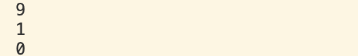

# 变量
```cpp
#include <iostream>

int main () {
  int i = 9;
  // read value into i        
  // print value of i
  bool b1 = true;
  bool b2 = false;
  std::cout << i << '\n'; 
  std::cout << b1 << '\n'; 
  std::cout << b2 << '\n'; 


}
```

输出

