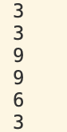

# vector数组

```cpp
#include <vector>
#include <iostream>

int main () {
using std::cout;
std::vector<int> v {3, 9, 3};
cout << v.size() << '\n';
cout << v[0] << '\n';
cout << v[1] << '\n';
v[0] = 6;
cout << v[1] << '\n';
cout << v.front() << '\n';
cout << v.back()  << '\n';
}


```

输出
