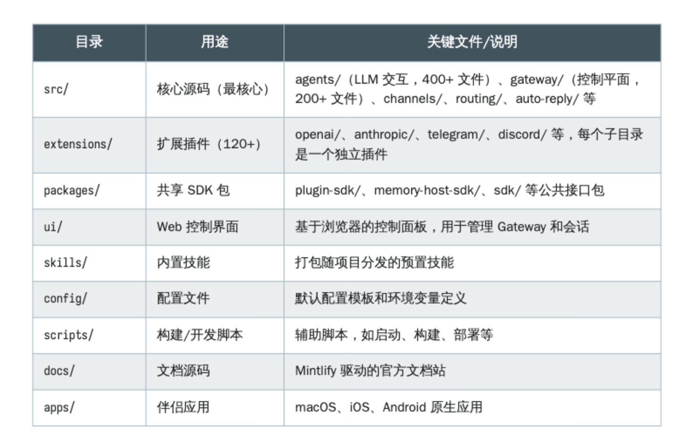
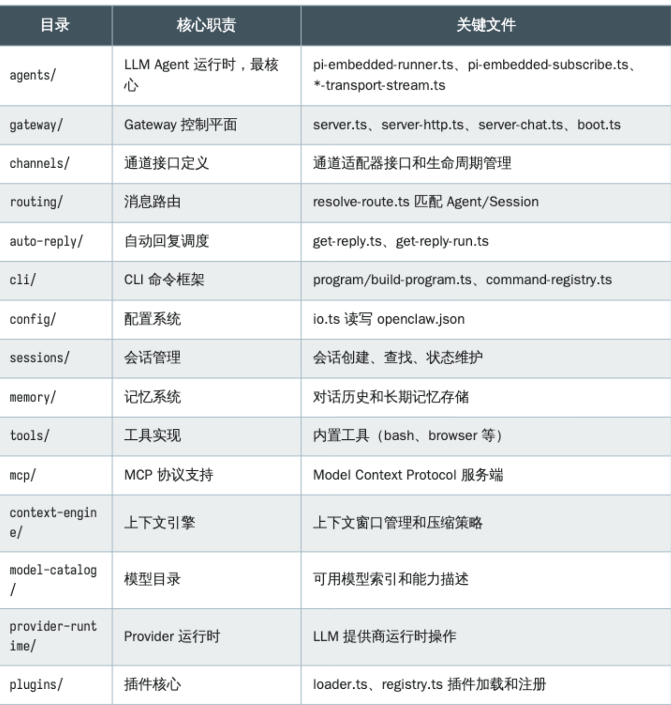
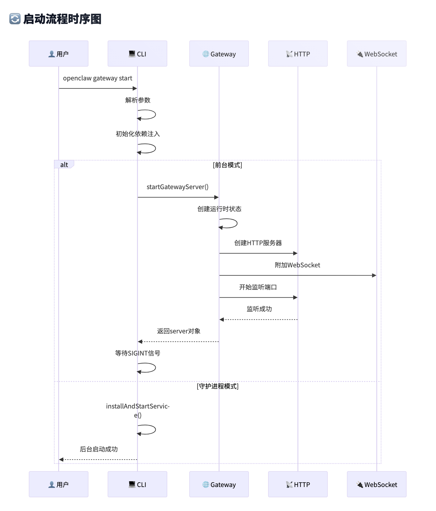

# 聊天助手bot
## openclaw
### 网关gateway层级
<font style="color:rgb(51, 51, 51);">网关是 OpenClaw 的中心控制平面，负责管理 WebSocket 连接、分发 RPC 方法、协调消息通道、编排代理运行以及维护系统状态。它作为一个单一的复用进程同时服务协议客户端（CLI、原生应用、控制界面）和通道提供者。</font>

<font style="color:rgb(51, 51, 51);">其中gateway采用了</font>**<font style="color:rgb(51, 51, 51);">统一的服务器架构</font>**<font style="color:rgb(51, 51, 51);">来同时处理WebSocket控制平面和HTTP API请求。传统的多进程架构会导致复杂的进程间通信和状态同步问题，而Gateway采用</font>**<font style="color:rgb(51, 51, 51);">单一进程多路复用</font>**<font style="color:rgb(51, 51, 51);">设计，在同一个端口上同时支持WebSocket实时通信和HTTP REST API，大大简化了系统复杂度并提高了性能</font>

##### <font style="color:rgb(51, 51, 51);">实现细节</font>
+ <font style="color:rgb(51, 51, 51);">1.1，首先通过</font>`**<font style="color:rgb(51, 51, 51);">loadServerImpl()</font>**`<font style="color:rgb(51, 51, 51);">延迟加载服务器实现</font>

```typescript
export async function startGatewayServer(
  ...args: Parameters<typeof import("./server.impl.js").startGatewayServer>
  ): ReturnType<typeof import("./server.impl.js").startGatewayServer> {
  const mod = await loadServerImpl();
return await mod.startGatewayServer(...args);
}
```

其次通过  return await mod.startGatewayServer(...args)

+ 1.2，实际启动服务器

```typescript
export async function startGatewayServer(
  port = 18789,
  opts: GatewayServerOptions = {},
): Promise<GatewayServer> {
  bootstrapGatewayNetworkRuntime();

```

+ 1.3，启动过程

启动过程：cliRun->startloop->runGatewayLoopWithSupervisedLockRecovery(startLoop)->startGatewayServer

startLoop函数

```typescript
const startLoop = async () =>
    await runGatewayLoop({
      runtime: defaultRuntime,
      lockPort: port,
      healthHost,
      start: async ({ startupStartedAt } = {}) =>
        await startGatewayServer(port, {
          bind,
          auth: authOverride,
          tailscale: tailscaleOverride,
          startupStartedAt,
        }),
    });
```

这里启动的

+ 2.1，服务器启动初始化

1，ensureOpenClawCliOnPath(); 确保cli工具可以使用

```typescript
export function ensureOpenClawCliOnPath(opts: EnsureOpenClawPathOpts = {}) {
  if (isTruthyEnvValue(process.env.OPENCLAW_PATH_BOOTSTRAPPED)) {
    return;
  }
  process.env.OPENCLAW_PATH_BOOTSTRAPPED = "1";

  const existing = opts.pathEnv ?? process.env.PATH ?? "";
  const { prepend, append } = candidateBinDirs(opts);
  if (prepend.length === 0 && append.length === 0) {
    return;
  }

  const merged = mergePath({ existing, prepend, append });
  if (merged) {
    process.env.PATH = merged;
  }
}
```

2，resolveMediaCleanupTtlMs 初始化配置

3，GatewayServerOptions 绑定服务地址

4，attachGatewayWsHandlers 引入websocket


3.1，安全认证链接


4.1，注册gateway节点


# openclaw 整体框架介绍
大致的过程：CLI 发命令，Gateway 启动和编排，Channel 收发消息，Routing 选 Agent/Session
，Auto-Reply 调模型生成回复，Outbound 发回通道，Config/Session/Media 持久化状态。
### 整体的源码目录结构

##### src目录结构内容


##### 架构思想
从上到下分别是：消息通道层（Channels）、Gateway 控制平面（Gateway）、嵌入式 Agent Runner（Agent 执行核心）、LLM 提供商层（
Providers）。这四个层次各司其职、松耦合协作，形成了一个"上层决定什么时候做，中间层决
定怎么做（队列、通道、会话），底层负责执行"的多层编排体系。

消息通道层负责与外部聊天平台的对接，将不同平台的消息格式统一为内部格式；
- Gateway 作为中央控制平面，管理会话、路由、插件生命周期、定时任务等；
- Agent Runner 是整个系统的"大脑"，负责系统提示词构建、上下文管理、模型选择、流式传输、工具执行等LLM 交互的全流程；
- LLM 提供商层则是与各家大模型 API 的通信层，支持 OpenAI Chat Completions、OpenAI Responses API、Anthropic Messages API 等主流格式。 
这种分层设计的核心好处是：任何一层的变化都不会扩散到其他层。例如，新增一个聊天通道只需要写一个
Channel Extension，不需要改动 Gateway 或 Agent Runner 的任何代码。

# gateway网关层级框架

作用：作为门卫校验权限，进行功能转发，再回传结论
网关层架构

### 认证与授权


### 会话与状态管理

### 多agent路由

# Session 模型

# 上下文引擎
# 通道绑定
# 多 Agent 路由 agent与工具
# 安全与沙箱
# 记忆插件槽


# 插件SDK+MCP