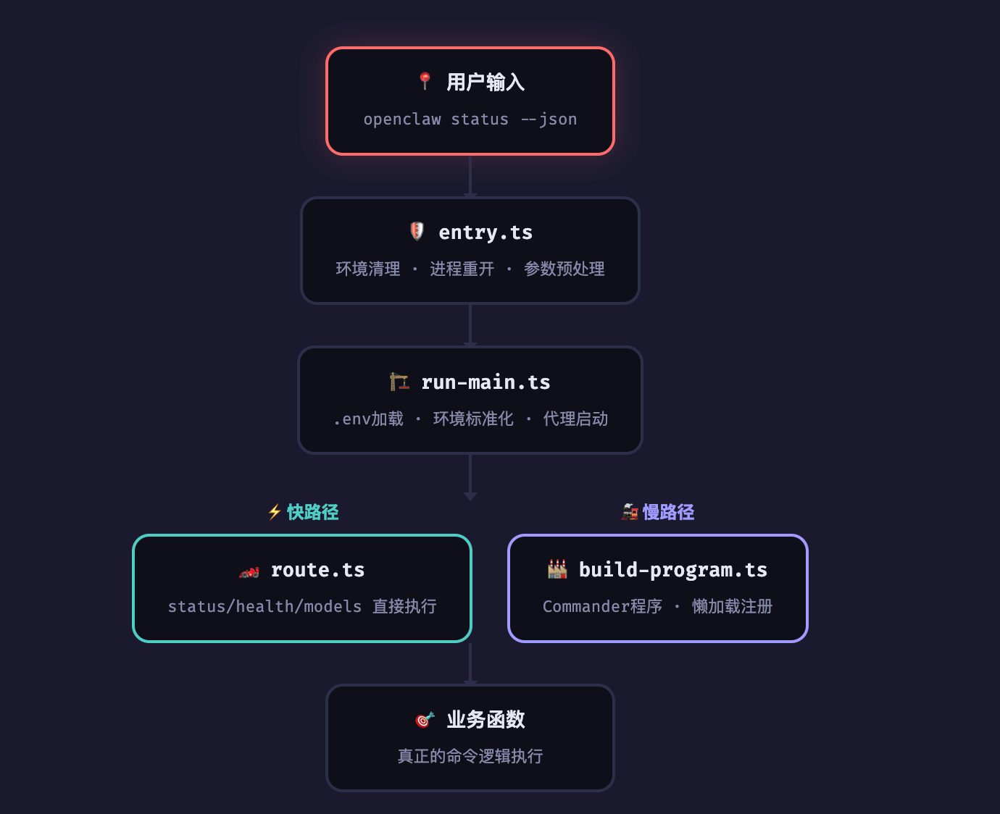

# 聊天助手bot
## openclaw
### 网关gateway层级
<font style="color:rgb(51, 51, 51);">网关是 OpenClaw 的中心控制平面，负责管理 WebSocket 连接、分发 RPC 方法、协调消息通道、编排代理运行以及维护系统状态。它作为一个单一的复用进程同时服务协议客户端（CLI、原生应用、控制界面）和通道提供者。</font>

<font style="color:rgb(51, 51, 51);">其中gateway采用了</font>**<font style="color:rgb(51, 51, 51);">统一的服务器架构</font>**<font style="color:rgb(51, 51, 51);">来同时处理WebSocket控制平面和HTTP API请求。传统的多进程架构会导致复杂的进程间通信和状态同步问题，而Gateway采用</font>**<font style="color:rgb(51, 51, 51);">单一进程多路复用</font>**<font style="color:rgb(51, 51, 51);">设计，在同一个端口上同时支持WebSocket实时通信和HTTP REST API，大大简化了系统复杂度并提高了性能</font>

##### <font style="color:rgb(51, 51, 51);">实现细节</font>
+ <font style="color:rgb(51, 51, 51);">1.1，首先通过</font>`**<font style="color:rgb(51, 51, 51);">loadServerImpl()</font>**`<font style="color:rgb(51, 51, 51);">延迟加载服务器实现</font>

```typescript
export async function startGatewayServer(
  ...args: Parameters<typeof import("./server.impl.js").startGatewayServer>
  ): ReturnType<typeof import("./server.impl.js").startGatewayServer> {
  const mod = await loadServerImpl();
return await mod.startGatewayServer(...args);
}
```

其次通过  return await mod.startGatewayServer(...args)

+ 1.2，实际启动服务器

```typescript
export async function startGatewayServer(
  port = 18789,
  opts: GatewayServerOptions = {},
): Promise<GatewayServer> {
  bootstrapGatewayNetworkRuntime();

```

+ 1.3，启动过程

启动过程：cliRun->startloop->runGatewayLoopWithSupervisedLockRecovery(startLoop)->startGatewayServer

startLoop函数

```typescript
const startLoop = async () =>
    await runGatewayLoop({
      runtime: defaultRuntime,
      lockPort: port,
      healthHost,
      start: async ({ startupStartedAt } = {}) =>
        await startGatewayServer(port, {
          bind,
          auth: authOverride,
          tailscale: tailscaleOverride,
          startupStartedAt,
        }),
    });
```

这里启动的

+ 2.1，服务器启动初始化

1，ensureOpenClawCliOnPath(); 确保cli工具可以使用

```typescript
export function ensureOpenClawCliOnPath(opts: EnsureOpenClawPathOpts = {}) {
  if (isTruthyEnvValue(process.env.OPENCLAW_PATH_BOOTSTRAPPED)) {
    return;
  }
  process.env.OPENCLAW_PATH_BOOTSTRAPPED = "1";

  const existing = opts.pathEnv ?? process.env.PATH ?? "";
  const { prepend, append } = candidateBinDirs(opts);
  if (prepend.length === 0 && append.length === 0) {
    return;
  }

  const merged = mergePath({ existing, prepend, append });
  if (merged) {
    process.env.PATH = merged;
  }
}
```

2，resolveMediaCleanupTtlMs 初始化配置

3，GatewayServerOptions 绑定服务地址

4，attachGatewayWsHandlers 引入websocket


3.1，安全认证链接


4.1，注册gateway节点


# openclaw 整体框架介绍
大致的过程：CLI 发命令，Gateway 启动和编排，Channel 收发消息，Routing 选 Agent/Session
，Auto-Reply 调模型生成回复，Outbound 发回通道，Config/Session/Media 持久化状态。
### 整体的源码目录结构

##### src目录结构内容


##### 架构思想
从上到下分别是：消息通道层（Channels）、Gateway 控制平面（Gateway）、嵌入式 Agent Runner（Agent 执行核心）、LLM 提供商层（
Providers）。这四个层次各司其职、松耦合协作，形成了一个"上层决定什么时候做，中间层决
定怎么做（队列、通道、会话），底层负责执行"的多层编排体系。

消息通道层负责与外部聊天平台的对接，将不同平台的消息格式统一为内部格式；
- Gateway 作为中央控制平面，管理会话、路由、插件生命周期、定时任务等；
- Agent Runner 是整个系统的"大脑"，负责系统提示词构建、上下文管理、模型选择、流式传输、工具执行等LLM 交互的全流程；
- LLM 提供商层则是与各家大模型 API 的通信层，支持 OpenAI Chat Completions、OpenAI Responses API、Anthropic Messages API 等主流格式。 
这种分层设计的核心好处是：任何一层的变化都不会扩散到其他层。例如，新增一个聊天通道只需要写一个
Channel Extension，不需要改动 Gateway 或 Agent Runner 的任何代码。

# gateway网关层级框架

作用：作为门卫校验权限，进行功能转发，再回传结论
网关层架构


### cli
首先思考下当用户输入 openclaw status，进行了哪些步骤呢？


会逐步进入 entry.ts、run-main.ts、route.ts、build-program.ts等文件
接下来看看源码到底咋实现的

##### entry函数
首先entry函数做的事情很多

+ 1，守卫检查 — isMainModule() 确认自己是主入口，不是被别的模块 import 进来的。这防止了打包工具导致的"重复启动"问题。
+ 2，设置进程名 — process.title = "openclaw"，让 ps aux 能看到漂亮的名字，而不是一长串 node 路径。
+ 3，环境清理 — 三个关键操作：
  - ensureOpenClawExecMarkerOnProcess() 标记进程身份

```typescript
export function ensureOpenClawExecMarkerOnProcess(
  env: NodeJS.ProcessEnv = process.env,
): NodeJS.ProcessEnv {
  env[OPENCLAW_CLI_ENV_VAR] = OPENCLAW_CLI_ENV_VALUE;
  return env;
}
```

        * 这里做的事情：往 process.env 里写入 OPENCLAW_CLI=1 ， 让子进程或后续加载的代码能识别出当前是在 OpenClaw CLI 的上下文中运行的 。
    - installProcessWarningFilter() 过滤 Node 实验性警告，将node内部的警告全部过滤掉

```typescript
export function normalizeZaiEnv(): void {
  if (!process.env.ZAI_API_KEY?.trim() && process.env.Z_AI_API_KEY?.trim()) {
    process.env.ZAI_API_KEY = process.env.Z_AI_API_KEY;
  }
}
```

这里做的事情主要为：用户设置了 Z_AI_API_KEY （旧名）但没设 ZAI_API_KEY （新名），自动做个映射。

    - normalizeEnv() 标准化环境变量
+ 4，编译缓存 — enableOpenClawCompileCache() 启用 V8 编译缓存，加速后续启动。
+ 5，自我重生 (Respawn) — ensureCliRespawnReady() 检查是否需要"重启自己"。如果缺少 --disable-warning=ExperimentalWarning 或需要注入 NODE_EXTRA_CA_CERTS，就会 spawn 一个子进程来替代自己！

entry核心函数内容

```python
// 守卫：只有当本文件是主模块时才执行
if (!isMainModule({ currentFile, wrapperEntryPairs })) {
  // 被其他模块 import 了，跳过所有入口逻辑
} else {
  // 1️⃣ 进程名
  process.title = "openclaw";

  // 2️⃣ 环境清理三件套
  ensureOpenClawExecMarkerOnProcess();
  installProcessWarningFilter();
  normalizeEnv();

  // 3️⃣ 编译缓存
  enableOpenClawCompileCache({ installRoot });

  // 4️⃣ --no-color 处理
  if (process.argv.includes("--no-color")) {
    process.env.NO_COLOR = "1";
    process.env.FORCE_COLOR = "0";
  }

  // 5️⃣ 自我重生（如果需要的话）
  if (!ensureCliRespawnReady()) {
    // 不需要重生，继续正常流程
    if (!tryHandleRootVersionFastPath(process.argv)) {
      await runMainOrRootHelp(process.argv);
    }
  }
}
```

+ 1,设置当前的进程名字为 "openclaw"
+ 2,调用环境清理函数
  - 在 CLI 真正开始干活之前，先把进程环境收拾干净，避免后续代码被环境问题干扰
+ 3，编译缓存
+ 4，--no-color 处理
+ 5，自我重生成进程计划ensureCliRespawnReady
  - 在启动 CLI 主逻辑之前，校验是否用特定的 Node.js 参数重新启动子进程，若需要，它会 fork 一个子进程来运行真正的 CLI，而父进程则退出

```typescript
const plan = buildCliRespawnPlan();
if (!plan) {
  return false;
}
```

    - 判断当前环境是否满足所有运行条件。若返回 null ，说明不需要重生成，函数返回 false ，父进程继续正常执行后面的 CLI 逻辑
    - const child = spawn 生成子进程，参数来源于buildCliRespawnPlan
    - attachChildProcessBridge，附加子进程桥接，用于在父进程和子进程之间转发信号（如 SIGINT、SIGTERM），确保用户按 Ctrl+C 时能正确终止子进程。

```typescript
child.once("exit", (code, signal) => {
  if (signal) {
    process.exitCode = 1;
    return;
  }
  process.exit(code ?? 1);
});
```

    - child.once("exit",)，处理子进程退出
        * - 如果子进程是被信号终止的（如 SIGKILL ），父进程设置退出码为 1
        * 否则，用子进程的退出码退出（如果子进程异常退出且没有退出码，默认用 1 ）

```typescript
child.once("error", (error) => {
  console.error(
    "[openclaw] Failed to respawn CLI:",
    error instanceof Error ? (error.stack ?? error.message) : error,
  );
  process.exit(1);
});
```

    - 处理子进程启动错误，spawn 本身失败（比如找不到 node 可执行文件），打印错误并退出。
    - 阻止父进程继续执行，返回 true 告诉调用方： 子进程已经启动，父进程不应该继续执行 CLI 逻辑 。

##### run.main 函数
<font style="color:#000000;">run-main.ts 是"调度中心" </font><font style="color:#000000;"></font><font style="color:#000000;">。它负责：加载环境变量、启动代理、判断走快路径还是慢路径</font>

<font style="color:#000000;">处理的流程</font>


+ 核心处理函数逻辑

```typescript
export async function runCli(argv = process.argv) {
  // ① 解析容器参数和 profile
  const parsedContainer = parseCliContainerArgs(argv);
  const parsedProfile = parseCliProfileArgs(parsedContainer.argv);

  // ② 加载 .env（如果存在）
  if (shouldLoadCliDotEnv()) {
    const { loadCliDotEnv } = await import("./dotenv.js");
    loadCliDotEnv({ quiet: true });
  }

  // ③ 标准化环境变量
  normalizeEnv();

  // ④ 确保 CLI 在 PATH 上（部分命令跳过以提速）
  if (shouldEnsureCliPath(normalizedArgv)) {
    ensureOpenClawCliOnPath();
  }

  // ⑤ 检查运行时版本
  assertSupportedRuntime();

  // ⑥ 启动代理（如果需要）
  if (shouldStartProxyForCli(normalizedArgv)) {
    proxyHandle = await startProxy(config?.proxy);
  }

  // ⑦ 快路径判断 — 根帮助
  if (shouldUseRootHelpFastPath(normalizedArgv)) { ... return; }

  // ⑧ 快路径判断 — 浏览器帮助
  if (shouldUseBrowserHelpFastPath(normalizedArgv)) { ... return; }

  // ⑨ 快路径判断 — Gateway run
  if (await tryRunGatewayRunFastPath(normalizedArgv, trace)) { return; }

  // ⑩ 快路径判断 — 路由快通道
  const { tryRouteCli } = await import("./route.js");
  if (await tryRouteCli(normalizedArgv)) { return; }

  // ⑪ 慢路径 — 构建 Commander 程序
  const { buildProgram } = await import("./program.js");
  const program = await buildProgram();
  await program.parseAsync(parseArgv);
}
```


### 认证与授权
### 会话与状态管理
### 多agent路由
# Session 模型
# 上下文引擎
# 通道绑定
# 多 Agent 路由 agent与工具
# 安全与沙箱
# 记忆插件槽
# 插件SDK+MCP