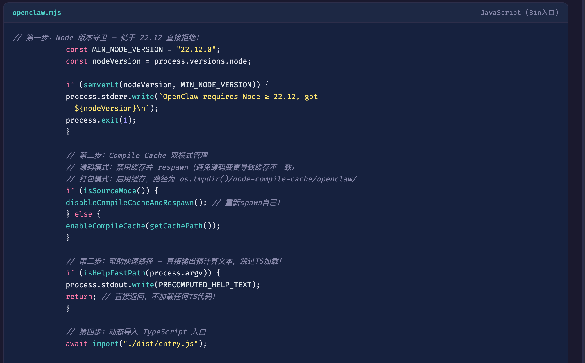
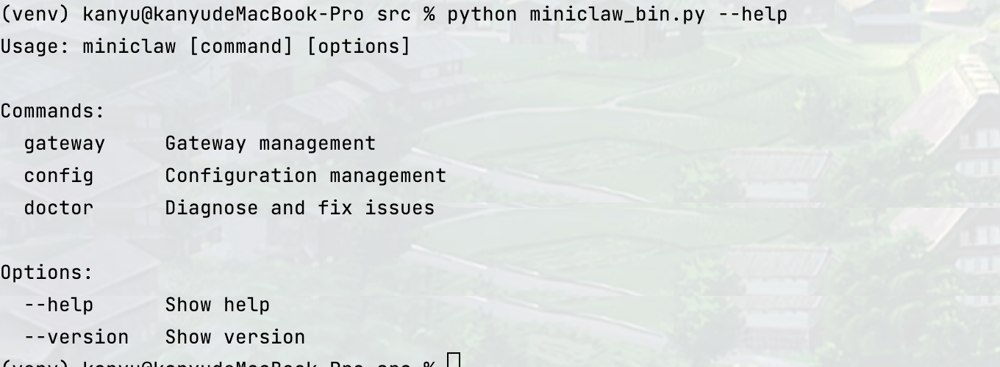

# 目标
用python 实现openclaw的gateway网关和cli架构


### Cli与启动类复刻

参考openclaw的入口守卫校验
1，Node 版本
2，判断isSourceMode
3，判断isHelpFastPath
4，动态导入entry入口

```python
import sys

MIN_PYTHON_MAJOR = 3
MIN_PYTHON_MINOR = 11

def parse_python_version(version_str: str) -> tuple[int, int]:
    parts = version_str.split(".")[:2]
    return int(parts[0]), int(parts[1]) if len(parts) > 1 else 0

def is_supported_python_version(version: tuple[int, int]) -> bool:
    return (
            version[0] > MIN_PYTHON_MAJOR or
            (version[0] == MIN_PYTHON_MAJOR and version[1] >= MIN_PYTHON_MINOR)
    )

def ensure_supported_python_version() -> None:
    current = parse_python_version(sys.version.split()[0])
    if is_supported_python_version(current):
        return
    sys.stderr.write(
        f"openclaw: Python 3.11+ is required "
        f"(current: {sys.version})\n"
    )
    sys.exit(1)

HELP_TEXT = """Usage: miniclaw [command] [options]

Commands:
  gateway     Gateway management
  config      Configuration management
  doctor      Diagnose and fix issues

Options:
  --help      Show help
  --version   Show version
"""

VERSION_TEXT = "miniclaw 0.1.0\n"

def try_output_help(argv: list[str]) -> bool:
    if "--help" in argv or "-h" in argv:
        sys.stdout.write(HELP_TEXT)
        return True
    return False

def try_output_version(argv: list[str]) -> bool:
    if "--version" in argv or "-v" in argv:
        sys.stdout.write(VERSION_TEXT)
        return True
    return False

def main() -> None:
    ensure_supported_python_version()
    argv = sys.argv
    if try_output_help(argv):
        return
    if try_output_version(argv):
        return
    # 🔗 连接点：下一阶段将接入 entry.py
    # from openclaw.entry import run_entry
    # asyncio.run(run_entry(argv))
    print("[openclaw] 守门人校验通过，等待 entry.py 接入...")

if __name__ == "__main__":
    main()
```
测试下  python miniclaw_bin.py --version
输出


测试下 python miniclaw_bin.py --help


测试下运行 miniclaw gateway

注意这里entry还没有实现先空着