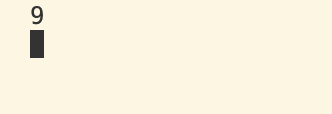
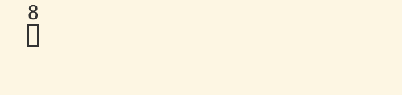

引用它和指针很像，都会指向某个数值，但引用本身不创建内存对象

```cpp
#include <iostream>


int main()
{
    int var = 8;
    int& ref = var;
    ref = 9;
    std::cout<< ref <<std::endl;
    std::cin.get();
}
```
可以看到打印了9

ref引用将对应的值改变了，但记住这不是指针

### 值传递和引用传递
- 值传递
```cpp
#include <iostream>

void Increment(int value){

    value++;
}

int main()
{
    int value = 8;
    Increment(value);
    std::cout<< value <<std::endl;
    std::cin.get();
}
```
想修改value的数值，打印会看到仍然是8 没有修改成9

因为这里传递的数值，它会在Increment函数直接拷贝一份传递的参数的数值，不会影响原来的数据value

# 传递指针
```cpp
#include <iostream>

void Increment(int* value){

    (*value)++;
}

int main()
{
    int value = 8;
    Increment(&value);
    std::cout<< value <<std::endl;
    std::cin.get();
}
```
可以看到value修改成了9
注意(*value)++ 数据运算符有优先级，不可写成 *value++ 这样的话是将地址+1再解引用了
