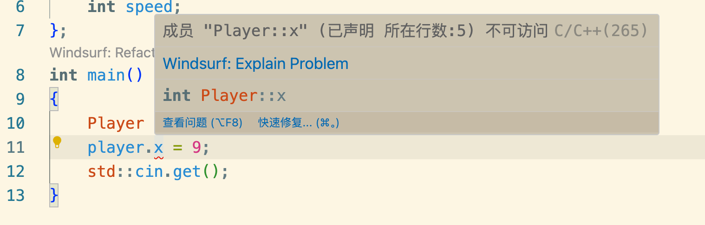

类是面向对象编程中过重要组成部分

像Java属于面向编程语言 程序的撰写和思想都符合面向对象编程 C语言不支持面向对象编程 C++既支持面向对象编程同时支持面向过程编程

# 类
### 举例
```cpp
#include <iostream>

class Player{

    int x,y;
    int speed;
};
int main()
{
    Player player;
    player.x = 9;
    std::cin.get();
}
```
像这样和Java差不多定义一个类和成员变量

可以看到编译报错了
因为class的成员有可见设置
私有变量外部不可访问，只有类内部的成员才可以访问，和Java差不多
这里得将内部变量设置为public 外部才可以访问到
```cpp
#include <iostream>

class Player{

public:
    int x,y;
    int speed;
};
int main()
{
    Player player;
    player.x = 9;
    std::cin.get();
}
```
这样就不会报错了

- move移动函数
```cpp
#include <iostream>

class Player{

public:
    int x,y;
    int speed;
};
void Move(Player& player,int xa,int ya){
    player.x += xa*player.speed;
    player.y += ya*player.speed;
}
int main()
{
    Player player;
    player.x = 9;
    std::cin.get();
}
```

- 改造成类内部函数，称之为方法
```cpp
#include <iostream>

class Player{

public:
    int x,y;
    int speed;
    void Move(int xa,int ya){
        x += xa*speed;
        y += ya*speed;
    }
};

int main()
{
    Player player;
    player.Move(3,3);
    std::cin.get();
}
```
这样代码可以简洁很多，当然不用这样改造同样可以完成功能，就像C语言那样，这样为了方便程序员简洁直观