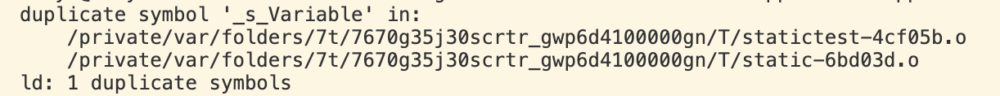

### 类或者结构体外部使用static
仅在当前的编译单元可使用
这个在之前编译链接将结果，当有多个

在其中一个文件撰写函数
```cpp
int s_Variable = 9;
```
另一个函数同样有s_Variable这个变量
```cpp
#include <iostream>

int s_Variable = 9;
int main()
{
    std::cin.get();
}
```
build发现报错了

增加static修饰
```cpp
static int s_Variable = 9;
```
重新build不报错

- 外部链接
```cpp
#include <iostream>

extern int s_Variable;
int main()
{
    std::cout << s_Variable << std::endl;
    std::cin.get();
}
```

```cpp
int s_Variable = 9;
```
这里编译可以通过且s_Variable打印数值为9，可以通过外部去寻找变量
但当外部的文件增加static修饰则会报错找不到


- 修饰函数
```cpp
#include <iostream>

// extern int s_Variable;
// static int s_Variable = 9;
void Function()
{

}
int main()
{
    // std::cout << s_Variable << std::endl;
    std::cin.get();
}
```
外部文件定义
```cpp
// static int s_Variable = 9;
void Function()
{

}
```

### 类或者结构体内部使用static
修饰内部变量和方法的时候，被类的所有实例共享同一个静态变量

