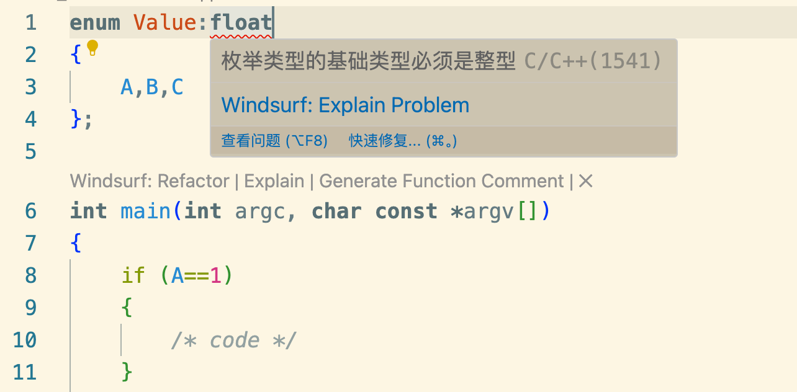

枚举类不设置初始值则会从0开始计算递增，若设置了第一个变量 后续都会递增加一
```cpp
enum{
    A,B,C
};

int main(int argc, char const *argv[])
{
    if (A==1)
    {
        /* code */
    }
    
    return 0;
}

```

可以看到C被递增赋予了2

类型可以设置枚举存储类型unsigned char 占1个字节，同样可以不设置
```cpp
enum Value:unsigned char
{
    A,B,C
};

int main(int argc, char const *argv[])
{
    if (A==1)
    {
        /* code */
    }
    
    return 0;
}

```
枚举只可以存储整数

当设置为float可以看到编译报错了

### 改造之前的Log函数
将之前的Log函数修改成枚举
```cpp
#include <iostream>

class Log{
 
public:
    enum Level
    {
       LogLevelError = 0,LogLevelWarning,LogLevelInfo
    };
private:
    Level m_LogLevel = LogLevelInfo; //默认设置日志等级为Info级别
public:    
    void setLevel(Level level){
        m_LogLevel = level;
    }
    void Error(const char* message){
        if (m_LogLevel>=LogLevelError)
            std::cout << "[Error]:" << message << std::endl;
    }
    void Warn(const char* message){
        if (m_LogLevel>=LogLevelWarning)
            std::cout << "[Warn]:" << message << std::endl;
    }
    void Info(const char* message){
        if (m_LogLevel>=LogLevelInfo)
            std::cout << "[Info]:" << message << std::endl;
    }
};

int main()
{
    Log log;
    log.setLevel(Log::LogLevelWarning);
    log.Warn("Hello");
    std::cin.get();
}
```
注意这里的枚举不是一个namespace
注意这里的枚举Level的名称没有命名成Error、Warn、Info作为变量，是因为有同名函数，重复命名会冲突
注意：枚举实际上是整数类型