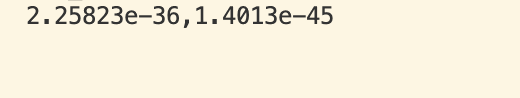
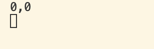

- 撰写一个打印函数
```cpp
#include <iostream>

class Entity{
 
public:
    float X,Y;
    void Print(){
        std::cout<< X << "," << Y << std::endl;
    }
};

int main()
{
    Entity e;
    e.Print();
    std::cin.get();
}
```

可以看到打印了两个不规则数据，这是因为当我们实例化该实体并为其分配内存时，并没有真正对那块内存进行初始化，这意味着我们读取到的只是那块内存空间中残留的任意数据。而我们真正想做的，通常是对这块内存进行初始化，将其清零或设置为类似的值，


### 增加Init函数初始化
```cpp
#include <iostream>

class Entity{
 
public:
    float X,Y;
    void Init(){
        X = 0.0f;
        Y = 0.0f;
    }
    void Print(){
        std::cout<< X << "," << Y << std::endl;
    }
};

int main()
{
    Entity e;
    e.Init();
    e.Print();
    std::cin.get();
}
```
在调用类实例函数之前先调用初始化函数赋值

可以看到打印的数值均为0，符合预期