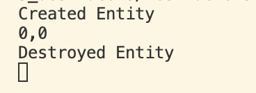

析构函数和构造函数反着来的：对于内存进行清理操作，析构函数会在你销毁对象时执行
析构函数既适用于栈分配的对象，也适用于堆分配的对象。
当调用delete当时候会执行析构函数

```cpp
#include <iostream>

class Entity{
 
public:
    float X,Y;
    Entity(){
        X = 0.0f;
        Y = 0.0f;
        std::cout<< "Created Entity" << std::endl;
    }
    ~Entity(){
        std::cout<< "Destroyed Entity" << std::endl;
    }

    void Print(){
        std::cout<< X << "," << Y << std::endl;
    }
};
void Function()
{
    Entity e;
    e.Print();
}
int main()
{   
    Function();
    std::cin.get();
}
```

可以看到先执行构造函数最后函数销毁执行析构函数

注意：至于在实际开发中为什么需要编写析构函数，如果构造函数中执行了某些初始化操作，通常就需要对应的在析构函数中去反初始化或销毁这些资源，否则就可能导致内存泄漏