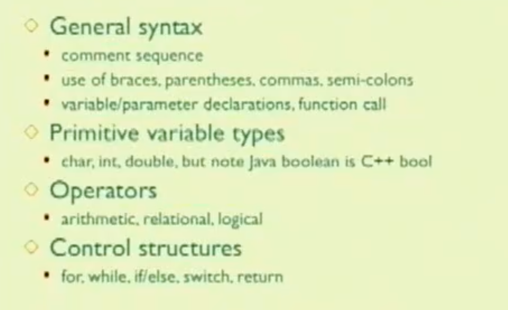
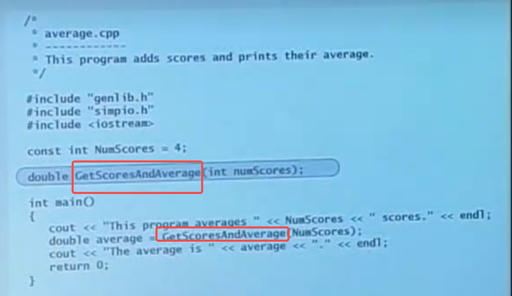
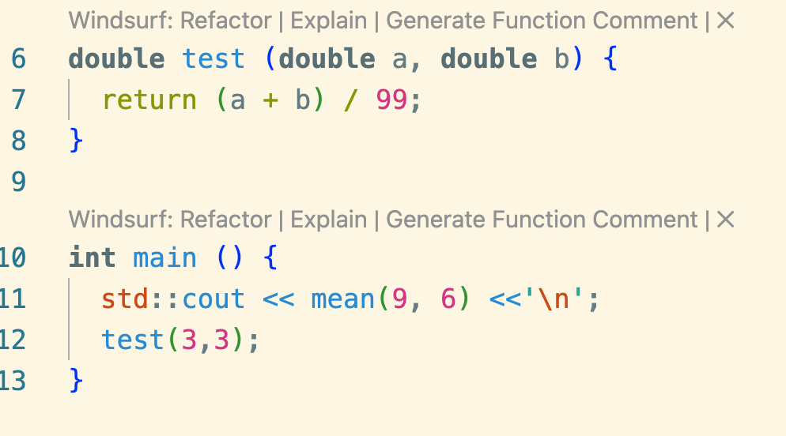
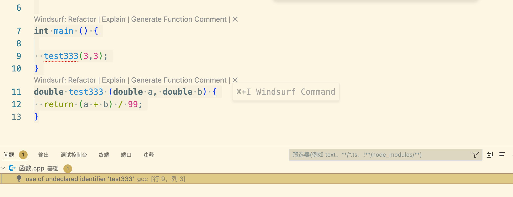
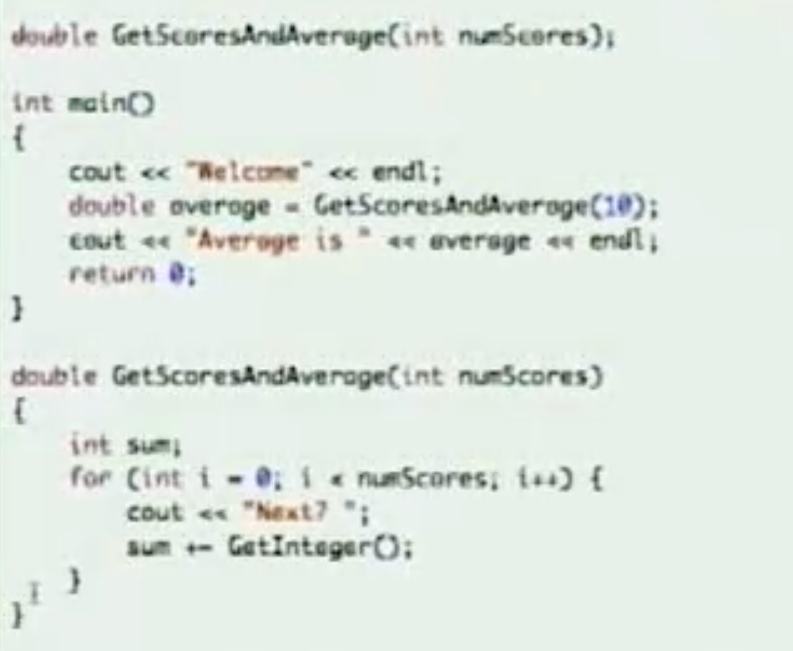
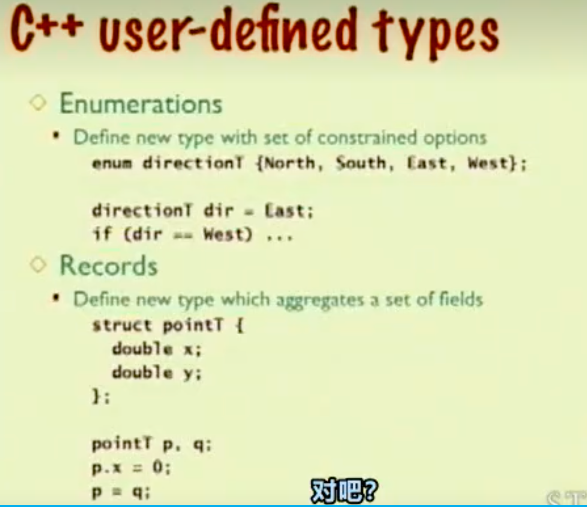
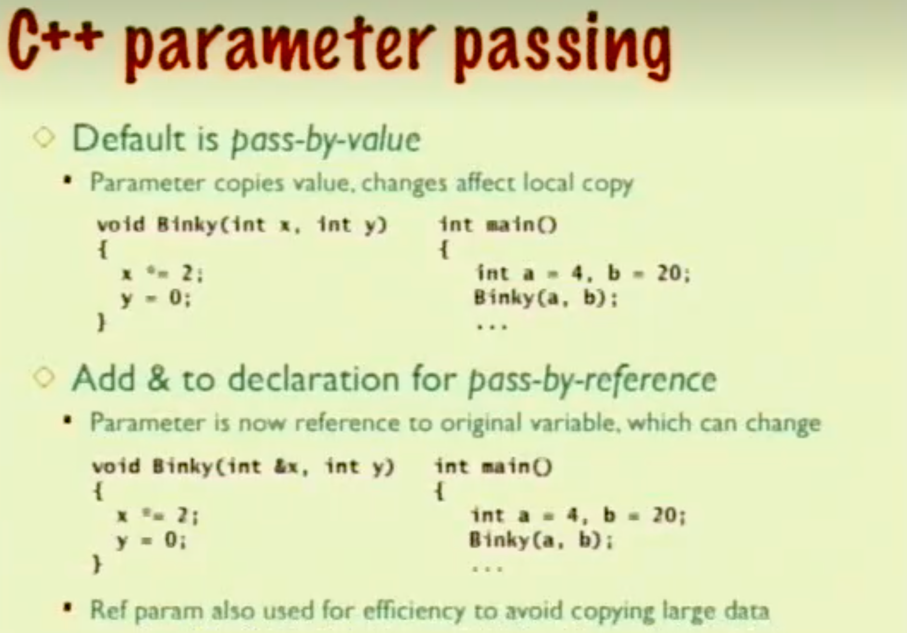

变量名称大多数相同，Java的布尔变量是boolean C++是 bool
# 编程范式
Java全都是在一个类中撰写程序，C++则是混合了C的面向过程和面向对象的混合编程范式
# 编译顺序

Java中编写函数A B C A调用B B调用C 无论它的前后顺序怎样 Java编译过程中都不会出错（Java编译器会浏览全部内容再回溯获取整体结构）
但C++会从上往下一次编译完成，假设GetScoresAndAverage函数注释掉或者写在main函数的下边，它就会报错

编译

可以看到编译不通过

```cpp
double test333 (double a, double b);
int main () {

  test333(3,3);
}
double test333 (double a, double b) {
  return (a + b) / 99;
}
```

改成这样就行了
在这之前声明下原型（作用提前告诉编译器函数会在下边出现）

# 流式输出

这里看起来有点难懂，可以类比Java的system.out.println
双小于号就是所谓的流插入
最后的endl是换行插入符号，类比于Java的\n


# 函数返回值和初始化变量
变量不初始化、函数没有返回值编译都可以通过，这个在Java中会报错



# 系统函数默认值 average(int sentinal=-1)
```cpp
double test(int num=3){
    num += 3;
    return num;
}
```
当调用者没有传递参数的时候，将会使用默认值
# 枚举

```cpp
enum directionT {North,South, East,West};
directionT dir = East;
if (dir == West){
    
}
```
枚举这里和Java差不多可以定义部分常量清晰直观地看出来这个变量干啥的
# 值传递 or 引用传递

这里假设参数为普通的int 直接传递的值，这个值完全复制了一份，它的作用域只在调用函数内部，在函数给它赋值还有任何操作都不会影响函数之外的变量
但假设参数加了一个&符号，这里调用参数传递的是这个值的地址，因此函数内部的改动都在同一个地址，因此会改变函数之外的值
