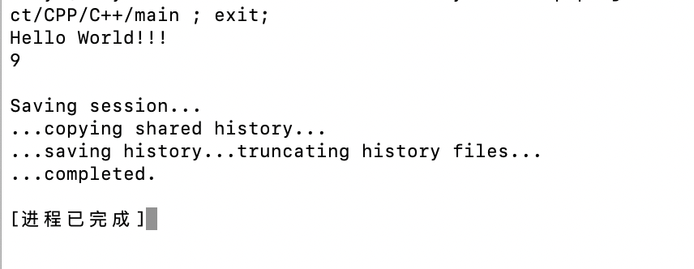
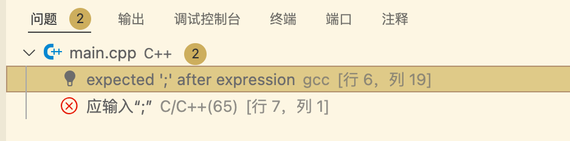
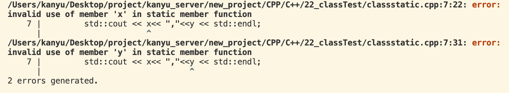
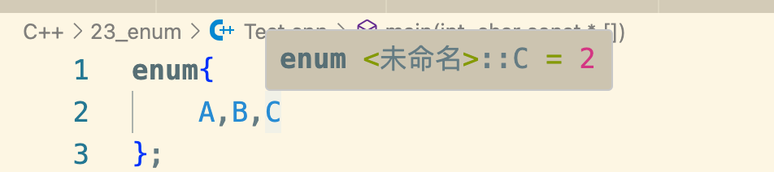
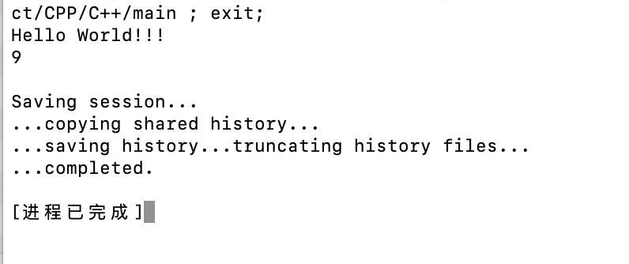

C++ 运行一个程序，首先经过编译，将文件编译成中间态文件文件格式，在编译过程中会去校验语法格式，若有语法错误，在output终端会报错

其中语法 #include<> 这样的语句指的是预处理，在文件编译之前已经被处理完成了，称之为头文件

std.cout.<< 类似于Java的system.print.out

这里的<< 是运算符重载函数

endl 为输入换行符号

std.getin 为等待用户输入

main函数返回值为int 当不限时返回的时候 会默认返回0

在mian函数文件中将打印语句封装到另一个函数中务必记住得在main函数中进行声明Log(自己封装的函数)，声明为了保证在编译缓解知道有这个函数通过编译，编译通过了，另一个Log实现函数文件同样得进行定义函数，若没有定义Log函数或者定义的实现函数名称写错了，则即使编译通过了，在链接（linking）环节同样会失败

链接简单地来说就是将多个已经编译完成的文件通过语法关系分析进行关系串联连接起来，完成函数的作用

运行hello world 函数
```cpp
#include <iostream>

int main () {

    std::cout << "Hello World!!!" << std::endl;
    std::cin.get();
}
```
点击运行，它会自动帮完成编译和链接的过程，输出一个可执行文件


可以看到程序没有结束 因为std::cin.get() 在等待用户输入


当输入任意和回车，进程将会结束

构造一个语法错误
```cpp
#include <iostream>

int main () {

    std::cout << "Hello World!!!" << std::endl;
    std::cin.get()
}
```
点击运行


在编译阶段就会报错，提示错误位置，在"问题"和终端这里都可以看到错误信息，不过一般看终端的信息是最全的，问题这里是通过终端的信息输出的，有可能不全，同时终端会输出很多其它的日志信息很有用


拆分成多个函数
Log函数专用来打印信息
```cpp
#include <iostream>

void Log(const char* Message) {

    std::cout << Message << std::endl;
}
```
```cpp
main函数改造
#include <iostream>
int main () {

    Log("Hello World!!!");
    std::cin.get();
}
```

可以看到输出报错了，找不到Log定义

这里注意报错是因为 C++ 在主函数编译的过程中在当前函数会去寻找函数的声明，若没有则直接报错了
```cpp
#include <iostream>
void Log(const char* Message);
int main () {

    Log("Hello World!!!");
    std::cin.get();
}
```

当在主函数执行之前加上 void Log(const char* Message);
声明就不会编译报错了

函数链接报错
当Log函数的大小写写错了或者没有这个Log函数
```cpp
#include <iostream>

void log(const char* Message) {

    std::cout << Message << std::endl;
}
```

可以看到链接阶段报错了
链接阶段会去寻找函数的定义实现，若找不到则会直接报错
将大小写修改回来则可以执行成功
