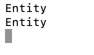
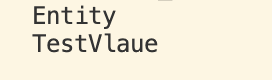

### 虚函数
虚函数允许我们在子类中重写方法。举个例子，假设我们有两个类：A 和 B，B 派生自 A，
也就是说 B 是 A 的子类。 如果我们在类 A 中创建一个方法并将其标记为虚函数，我们就可以选择在类 B 中重写该方法，
让它执行不同的逻辑。
- 程序举例子
```cpp
#include <iostream>

class Entity{
public:
    std::string GetName()
    {
        return "Entity";
    }
};

class Player : public Entity
{
private:
    std::string m_Name;
public:
    Player(const std::string& name):m_Name(name)
    {

    }
    std::string GetName()
    {
        return m_Name;
    }
};
void PrintName(Entity* entity)
{
    std::cout << entity->GetName() <<std::endl;
}
int main()
{   
    Entity* e = new Entity();
    PrintName(e);
    Player* p = new Player("TestVlaue");
    PrintName(p);
    std::cin.get();
}
```

可以看到打印了两个Entity，这个不符合预期，因为Player p明显赋值了"TestVlaue",这个是因为在创建实例调用PrintName传入了Entity ，传入了Player，但接受参数为Entity类接受的因此只会到Entity类中去调用GetName函数
但现在预期得去调用子类的GetName，这里就得利用多态机制，采用虚函数标识
- 改造程序
```cpp
#include <iostream>

class Entity{
public://父类函数采用virtual标识为虚函数 子类可以重写
    virtual std::string GetName()
    {
        return "Entity";
    }
};

class Player : public Entity
{
private:
    std::string m_Name;
public:
    Player(const std::string& name):m_Name(name)
    {

    } // override 可以不写同样可以知道这个是一个重写函数，但是协商override这样可读性更强
    std::string GetName() override
    {
        return m_Name;
    }
};
void PrintName(Entity* entity)
{
    std::cout << entity->GetName() <<std::endl;
}
int main()
{   
    Entity* e = new Entity();
    PrintName(e);
    Player* p = new Player("TestVlaue");
    PrintName(p);
    std::cin.get();
}
```

可以看到打印符合预期了