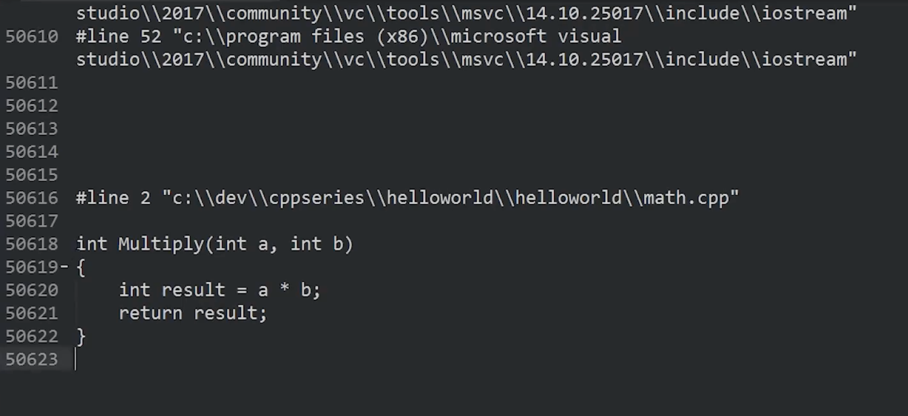
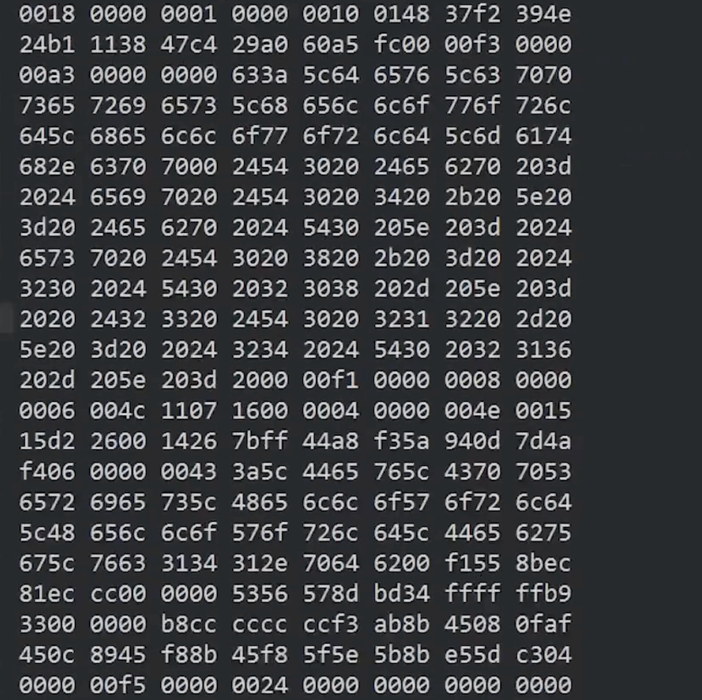
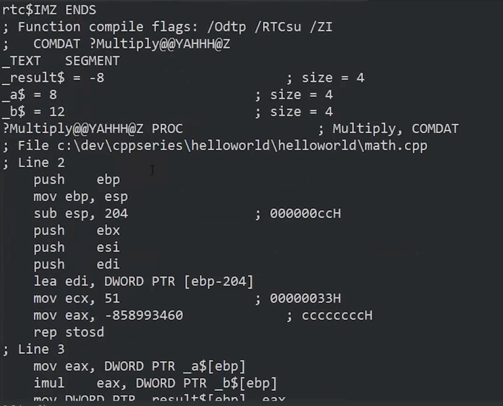
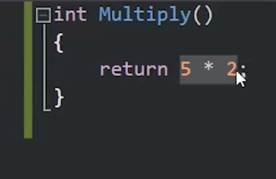
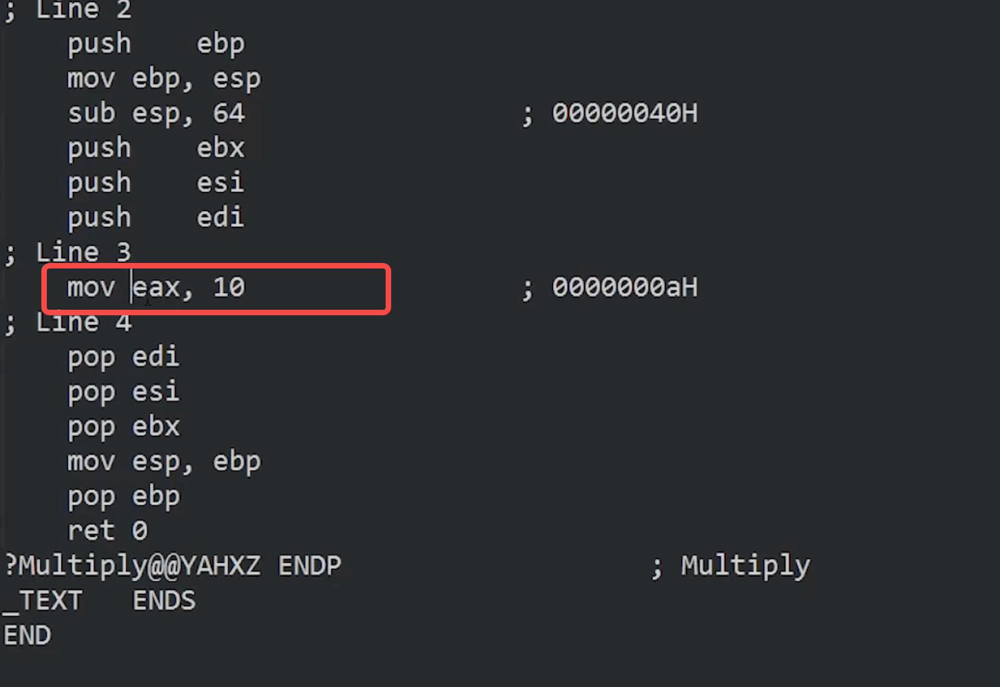

C++编译器最关键的任务就是处理我们的文本文件，将它转换成一个中间文件-obj目标文件，这些目标文件随后将被交给链接器处理,由它完成所有链接操作

本节课讲解编译过程
- 预处理文件处理
- 词法分析和语法分析（将C++源代码处理成编译器可以理解的格式，会生成抽象语法树AST）
- 启动代码生成


注意：文件不具备像Java那样的含义，用户完全可以自定义文件的含义，默认.c、.cpp、.h分别表示 C、C++、头文件，还可以.ttt 为文件格式 只需告诉编译器如何编译就行了

单个CPP文件不一定就对应一个编译单元。不过如果你创建的项目中每个CPP文件都是单独编译的,从不相互引用,那么在这种情况下,每个CPP文件就是一个编译单元,每个文件都都会生成一个目标文件;其它的情况不一定对应着一个编译单元

- 预处理
将#include的文件原封不动的复制过来
  
举例子
```cpp
#include <iostream>

void Log(const char* Message) {

    std::cout << Message << std::endl;
#include"value.h"
```
这里value.h编写如下
}
进行编译  clang++ -std=c++17  main.cpp  Log.cpp -o main
发现编译通过了
可以证明预处理直接将文件原封不动的复制过来到cpp文件中

其它的指令：'#define #if #endif'

比如#define 用来自定义将某个符号指定声明任意符号 在预处理后的文件会看到define处理后的函数
比如#if #endif 若符号即为真会展示内容 为假则不会展示内容


可以看到iostream头文件有5万多行，因此编译后的文件才会如此之大

编译->机器码
可以看到都是16进制代码 看不懂

可以借助成asm汇编文件 可以让人看懂

这里即汇编指令

# 常量折叠

将函数修改成常量相乘

这类固定常量值完全可以在编译期处理