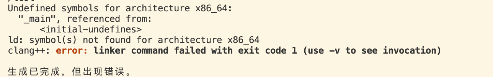
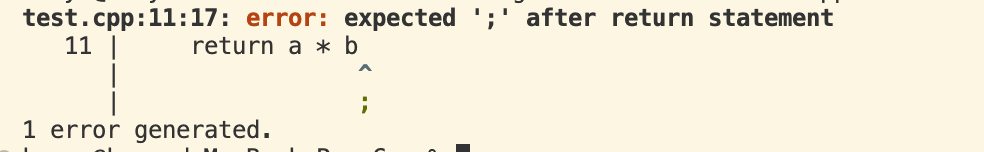
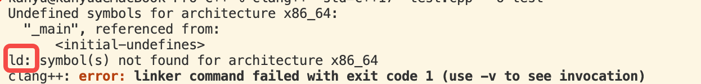
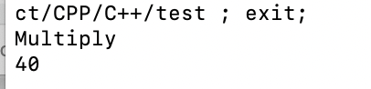
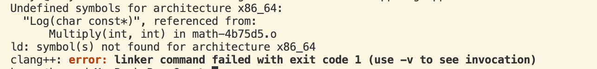
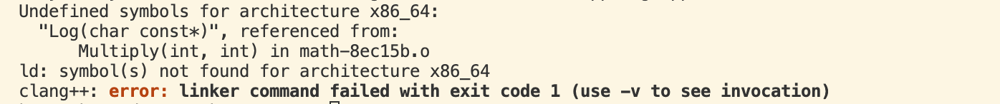

# 简介
链接(linking):在编译完成之后，找到所有符号和函数的存储位置，将它们关联起来

注意源文件在编译成目标单元的过程中，都是有独立的编译单元，互相没有关系的，这些文件无法进行交互，因此需通过链接将所有部分整合成一个可执行程序

# 程序举例
```cpp
#include <iostream>

void Log(const char* message)
{
    std::cout<<message << std::endl;
}

int Multiply(int a, int b)
{
    Log("Multiply");
    return a * b;
}
```
点击build 会执行进行编译和链接操作

发现直接报错了，提示没有定义初始化，没有main入口

编译报错日志

链接报错日志


这里看到编译报错会明确指出报错点和应该怎样修复，链接报错会有ld:指出来具体报错类型

现在加上main函数
```cpp
#include <iostream>

void Log(const char* message)
{
    std::cout<<message << std::endl;
}

int Multiply(int a, int b)
{
    Log("Multiply");
    return a * b;
}

int main()
{

}
```
可以看到build成功了

补充调用Multiply

将Log函数单独拆分一个文件
注意Log函数得声明头文件
```cpp
#include <iostream>

void Log(const char* Message) {

    std::cout << Message << std::endl;

}
```

同时math函数得注意声明Log函数让编译器知道有Log函数的存在


# 常见的linking错误

### 未定义的引用(undefined reference)
当Log函数名称不对或者不存在，点击build构建

可以看到Undefined symbols 报错提示：Log(char const*)找不到
还指出了调用者：referenced from:
Multiply(int, int) in math-4b75d5.o

这里指的是：在编译器执行链接的过程中看到Log函数，去找的时候找不到因此报错了

注意：这里注释掉Log函数的调用
```cpp
#include <iostream>

void Log(const char* message);
int Multiply(int a, int b)
{
    // Log("Multiply");
    return a * b;
}

int main()
{
    std::cout<< Multiply(8,5) <<std::endl;
    std::cin.get();
}
```
重新build
可以看到没有报错，因为Log没有调用 不需要他了 因此linking阶段不会去寻找它，因此不报错了
但是这里仅注释Multiply的调用，Log不注释
```cpp
#include <iostream>

void Log(const char* message);
int Multiply(int a, int b)
{
    Log("Multiply");
    return a * b;
}

int main()
{
    // std::cout<< Multiply(8,5) <<std::endl;
    std::cin.get();
}
```
可以看到build报错了：

但是咱没有调用过Log函数为啥还报错？
虽然当前文件没有调用Log函数，但其它的文件会调用Multiply这个函数，因此它仍然会去寻找Log函数是否存在