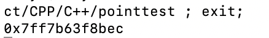
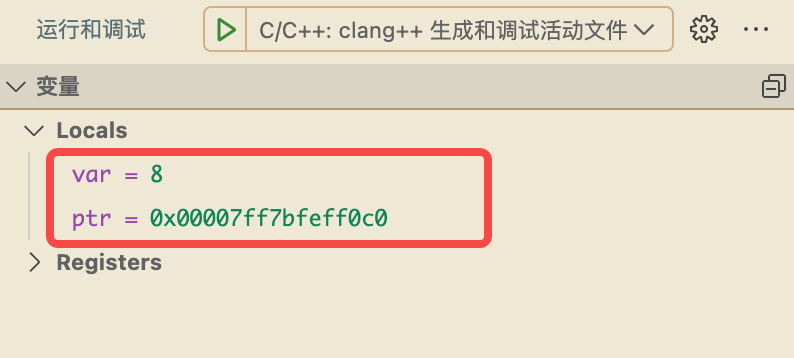
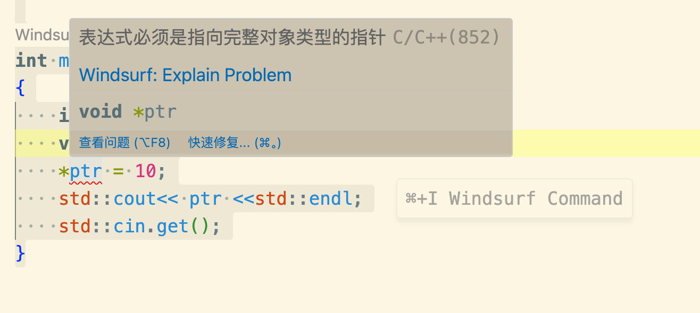
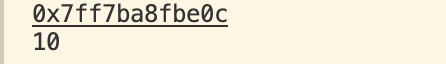

指针和C语言的指针差不多 * &

指针本质是内存地址

```cpp
#include <iostream>


int main()
{
    int var = 8;
    void* ptr = &var;
    std::cout<< ptr <<std::endl;
    std::cin.get();
}
```

编译执行

可以看到打印出来一个16进制的数字，这个是它的地址

给程序打上断点，可以看到对应的指针地址和对应的value


# 解引用
从变量到指针刚才讲解了，现在来看看从指针的地址到数据如何得到
```cpp
#include <iostream>


int main()
{
    int var = 8;
    void* ptr = &var;
    *ptr = 10;
    std::cout<< ptr <<std::endl;
    std::cin.get();
}
```
*ptr 将指针原本指向的数据修改成了10 但是会发现报错

这个是因为指针类型为void类型 它不知道这个字节数量到底是多少，因此这里类型就发挥了重大作用，指定修改指针的类型为int类型
```cpp
#include <iostream>


int main()
{
    int var = 8;
    int* ptr = &var;
    *ptr = 10;
    std::cout<< ptr <<std::endl;
    std::cin.get();
}
```

将它重新执行看到数据修改成了10

### 分配内存
memset
```cpp
#include <iostream>
int main()
{
    char * value = new char[8];
    memset(value,0,8);
    delete[] value;
    std::cin.get();
}
```
memset 分配内存
delete 清理内存