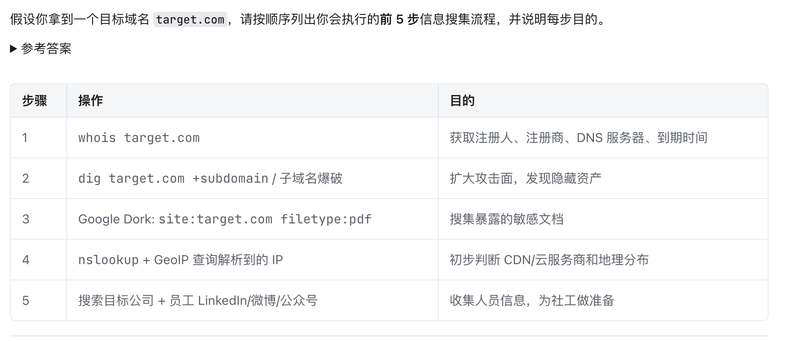

# <font style="color:rgb(26, 26, 26);">网络信息搜集技巧总结</font>
## <font style="color:rgb(26, 26, 26);">一、公开渠道信息搜集</font>
### <font style="color:rgb(26, 26, 26);">1. 目标基础信息</font>
+ **<font style="color:rgb(26, 26, 26);">Web 网页</font>**<font style="color:rgb(26, 26, 26);">：目标网站的结构、技术栈、页面内容、子域名</font>
+ **<font style="color:rgb(26, 26, 26);">地理位置</font>**<font style="color:rgb(26, 26, 26);">：物理地址、办公地点、数据中心位置</font>
+ **<font style="color:rgb(26, 26, 26);">相关组织</font>**<font style="color:rgb(26, 26, 26);">：关联公司、合作伙伴、供应商、子公司</font>

### <font style="color:rgb(26, 26, 26);">2. 组织与人员信息</font>
+ **<font style="color:rgb(26, 26, 26);">组织结构</font>**<font style="color:rgb(26, 26, 26);">：部门架构、管理层级、汇报关系</font>
+ **<font style="color:rgb(26, 26, 26);">个人资料</font>**<font style="color:rgb(26, 26, 26);">：员工姓名、职位、工作经历、社交账号</font>
+ **<font style="color:rgb(26, 26, 26);">联系方式</font>**<font style="color:rgb(26, 26, 26);">：电话号码、电子邮件地址、办公地址</font>

### <font style="color:rgb(26, 26, 26);">3. 网络与安全技术细节</font>
+ **<font style="color:rgb(26, 26, 26);">网络配置</font>**<font style="color:rgb(26, 26, 26);">：域名系统、IP 段、路由信息、开放端口</font>
+ **<font style="color:rgb(26, 26, 26);">安全防护</font>**<font style="color:rgb(26, 26, 26);">：防火墙类型、WAF 规则、CDN 服务商、SSL 证书信息</font>
+ **<font style="color:rgb(26, 26, 26);">技术栈</font>**<font style="color:rgb(26, 26, 26);">：服务器软件、框架版本、CMS 类型</font>

---

## <font style="color:rgb(26, 26, 26);">二、搜索引擎高级技巧</font>
### <font style="color:rgb(26, 26, 26);">Google Hacking / Dorking</font>
<font style="color:rgb(26, 26, 26);">利用特定语法精准定位敏感信息：</font>

| **<font style="color:rgb(26, 26, 26);">语法</font>** | **<font style="color:rgb(26, 26, 26);">作用</font>** | **<font style="color:rgb(26, 26, 26);">示例</font>** |
| :--- | :--- | :--- |
| `<font style="color:rgb(91, 96, 102);">site:</font>` | <font style="color:rgb(91, 96, 102);">限定域名范围</font> | `<font style="color:rgb(91, 96, 102);">site:example.com admin</font>` |
| `<font style="color:rgb(91, 96, 102);">filetype:</font>` | <font style="color:rgb(91, 96, 102);">搜索特定文件</font> | `<font style="color:rgb(91, 96, 102);">filetype:pdf 内部</font>` |
| `<font style="color:rgb(91, 96, 102);">inurl:</font>`<br/><font style="color:rgb(91, 96, 102);"> </font><font style="color:rgb(91, 96, 102);">/</font><font style="color:rgb(91, 96, 102);"> </font>`<font style="color:rgb(91, 96, 102);">intitle:</font>` | <font style="color:rgb(91, 96, 102);">URL/标题关键词</font> | `<font style="color:rgb(91, 96, 102);">inurl:admin.php</font>` |
| `<font style="color:rgb(91, 96, 102);">"</font>`<br/><font style="color:rgb(91, 96, 102);"> </font>`<font style="color:rgb(91, 96, 102);">"</font>` | <font style="color:rgb(91, 96, 102);">精确匹配</font> | `<font style="color:rgb(91, 96, 102);">"后台登录"</font>` |
| `<font style="color:rgb(91, 96, 102);">cache:</font>` | <font style="color:rgb(91, 96, 102);">查看缓存快照</font> | `<font style="color:rgb(91, 96, 102);">cache:example.com</font>` |
| `<font style="color:rgb(91, 96, 102);">-</font>` | <font style="color:rgb(91, 96, 102);">排除关键词</font> | `<font style="color:rgb(91, 96, 102);">site:example.com -www</font>` |


**<font style="color:rgb(26, 26, 26);">典型 Google Hacking 场景：</font>**

+ <font style="color:rgb(26, 26, 26);">查找后台登录页面：</font>`<font style="color:rgb(23, 24, 26);">inurl:login / admin / manage</font>`
+ <font style="color:rgb(26, 26, 26);">暴露的配置文件：</font>`<font style="color:rgb(23, 24, 26);">filetype:env config</font>`
+ <font style="color:rgb(26, 26, 26);">目录遍历漏洞：</font>`<font style="color:rgb(23, 24, 26);">intitle:"index of" "parent directory"</font>`
+ <font style="color:rgb(26, 26, 26);">包含敏感信息的文档：</font>`<font style="color:rgb(23, 24, 26);">filetype:docx 密码</font>`

### <font style="color:rgb(26, 26, 26);">基本搜索原则</font>
1. **<font style="color:rgb(26, 26, 26);">关键词精简</font>**<font style="color:rgb(26, 26, 26);">：用最可能出现的目标词汇</font>
2. **<font style="color:rgb(26, 26, 26);">独特描述</font>**<font style="color:rgb(26, 26, 26);">：选择能区分目标与噪声的特征词</font>
3. **<font style="color:rgb(26, 26, 26);">逐步细化</font>**<font style="color:rgb(26, 26, 26);">：从宽到窄，不断调整关键词组合</font>

---

## <font style="color:rgb(26, 26, 26);">三、社会公共信息库查询</font>
| **<font style="color:rgb(26, 26, 26);">查询对象</font>** | **<font style="color:rgb(26, 26, 26);">推荐工具/平台</font>** | **<font style="color:rgb(26, 26, 26);">可获取信息</font>** |
| :--- | :--- | :--- |
| **<font style="color:rgb(91, 96, 102);">个人信息</font>** | <font style="color:rgb(91, 96, 102);">人口统计局、户籍系统</font> | <font style="color:rgb(91, 96, 102);">身份背景、居住信息</font> |
| **<font style="color:rgb(91, 96, 102);">企业实体</font>** | <font style="color:rgb(91, 96, 102);">YellowPage、企业信用信息网、天眼查、企查查</font> | <font style="color:rgb(91, 96, 102);">注册信息、法人代表、股东结构、经营状态、联系方式</font> |
| **<font style="color:rgb(91, 96, 102);">域名/IP</font>** | `<font style="color:rgb(91, 96, 102);">whois</font>`<br/><font style="color:rgb(91, 96, 102);"> </font><font style="color:rgb(91, 96, 102);">查询</font> | <font style="color:rgb(91, 96, 102);">注册人、注册商、DNS 服务器、过期时间</font> |
| **<font style="color:rgb(91, 96, 102);">网站历史</font>** | <font style="color:rgb(91, 96, 102);">Wayback Machine</font> | <font style="color:rgb(91, 96, 102);">网页历史快照、已删除内容</font> |
| **<font style="color:rgb(91, 96, 102);">证书信息</font>** | <font style="color:rgb(91, 96, 102);">crt.sh / Censys</font> | <font style="color:rgb(91, 96, 102);">SSL 证书详情、子域名枚举</font> |


---

## <font style="color:rgb(26, 26, 26);">四、地图与街景搜索</font>
### <font style="color:rgb(26, 26, 26);">国外平台</font>
+ **<font style="color:rgb(26, 26, 26);">Google Maps</font>**<font style="color:rgb(26, 26, 26);">：地点搜索、卫星视图、商家信息</font>
+ **<font style="color:rgb(26, 26, 26);">Google Earth</font>**<font style="color:rgb(26, 26, 26);">：历史影像、3D 地形</font>
+ **<font style="color:rgb(26, 26, 26);">Google Street View</font>**<font style="color:rgb(26, 26, 26);">：街景实景、建筑物外观、周边环境</font>

### <font style="color:rgb(26, 26, 26);">国内平台</font>
+ **<font style="color:rgb(26, 26, 26);">百度地图</font>**<font style="color:rgb(26, 26, 26);">：地点检索、街景、卫星图层</font>
+ **<font style="color:rgb(26, 26, 26);">高德地图</font>**<font style="color:rgb(26, 26, 26);">：POI 数据、实时路况</font>
+ **<font style="color:rgb(26, 26, 26);">腾讯地图</font>**<font style="color:rgb(26, 26, 26);">：街景覆盖、室内地图</font>

### <font style="color:rgb(26, 26, 26);">应用场景</font>
+ <font style="color:rgb(26, 26, 26);">从网络资产推断物理位置</font>
+ <font style="color:rgb(26, 26, 26);">验证目标组织的实际存在性</font>
+ <font style="color:rgb(26, 26, 26);">结合 EXIF 地理标签定位拍摄地点</font>

---

## <font style="color:rgb(26, 26, 26);">五、IP 地理位置追踪</font>
| **<font style="color:rgb(26, 26, 26);">工具/数据库</font>** | **<font style="color:rgb(26, 26, 26);">特点</font>** | **<font style="color:rgb(26, 26, 26);">用途</font>** |
| :--- | :--- | :--- |
| **<font style="color:rgb(91, 96, 102);">Whois 数据库</font>** | <font style="color:rgb(91, 96, 102);">官方注册信息</font> | <font style="color:rgb(91, 96, 102);">查询 IP/ASN 的分配归属</font> |
| **<font style="color:rgb(91, 96, 102);">GeoIP</font>**<font style="color:rgb(91, 96, 102);"> </font><font style="color:rgb(91, 96, 102);">(MaxMind)</font> | <font style="color:rgb(91, 96, 102);">商业级定位库</font> | <font style="color:rgb(91, 96, 102);">国家、城市、经纬度、ISP</font> |
| **<font style="color:rgb(91, 96, 102);">IP2Location</font>** | <font style="color:rgb(91, 96, 102);">多精度定位</font> | <font style="color:rgb(91, 96, 102);">提供多种数据库粒度</font> |
| **<font style="color:rgb(91, 96, 102);">纯真数据库</font>** | <font style="color:rgb(91, 96, 102);">中文本土数据</font> | <font style="color:rgb(91, 96, 102);">QQ IP 查询、网吧/宽带归属</font> |


**<font style="color:rgb(26, 26, 26);">使用建议：</font>**

+ <font style="color:rgb(26, 26, 26);">IP 定位精度通常为城市级，精确到门牌号几乎不可能</font>
+ <font style="color:rgb(26, 26, 26);">结合多个数据库交叉验证，减少误差</font>
+ <font style="color:rgb(26, 26, 26);">注意 VPN、代理、CDN 对定位结果的干扰</font>

---

## <font style="color:rgb(26, 26, 26);">六、综合工作流建议</font>
<font style="color:rgb(91, 96, 102);">Plain Text</font>

```plain
1. 确定目标范围 → 域名、公司名、人名、邮箱
      ↓
2. 搜索引擎广泛搜集 → Google/Baidu Dorking
      ↓
3. 基础设施枚举 → 子域名、IP 段、WHOIS、证书
      ↓
4. 人员与组织深挖 → 社交网络、企业信息库
      ↓
5. 物理世界关联 → 地图、街景、IP 地理位置
      ↓
6. 信息整合与验证 → 交叉比对、排除噪音
```

**<font style="color:rgb(91, 96, 102);">提示</font>**<font style="color:rgb(91, 96, 102);">：所有信息搜集活动应遵守法律法规，仅用于合法授权的安全测试或研究目的。未经授权的渗透测试和信息搜集可能触犯法律。</font>


# 题目
