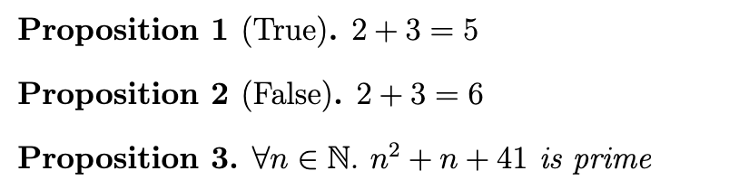
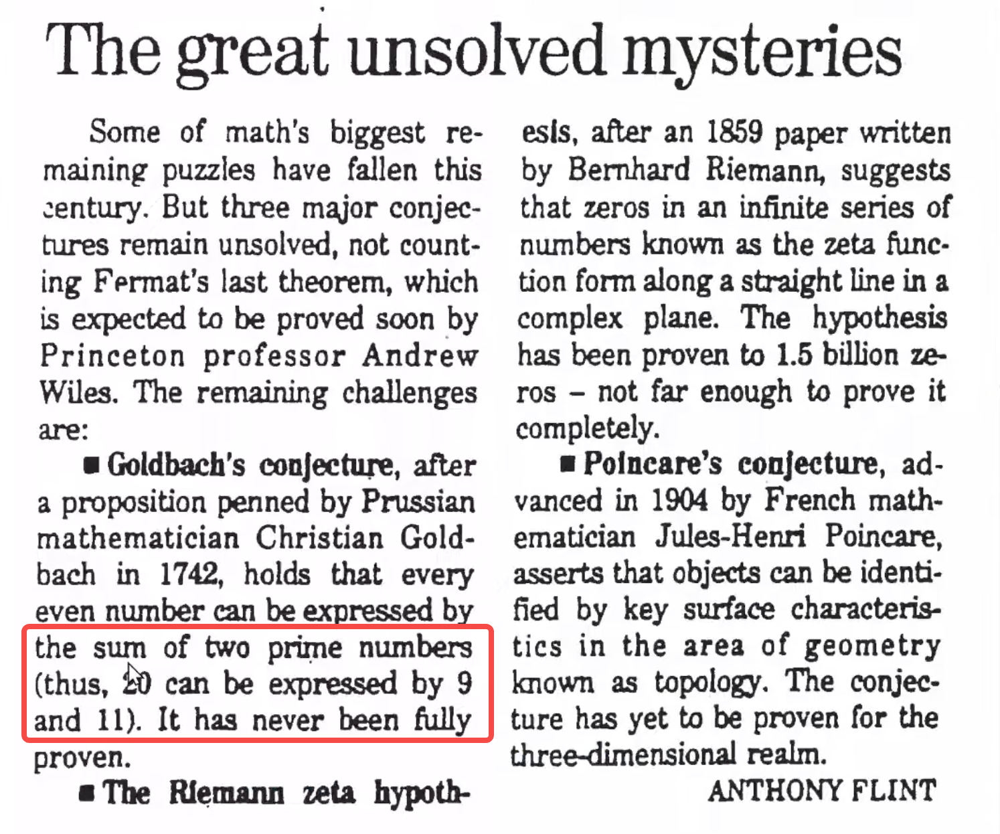
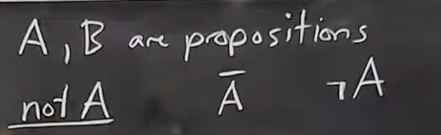
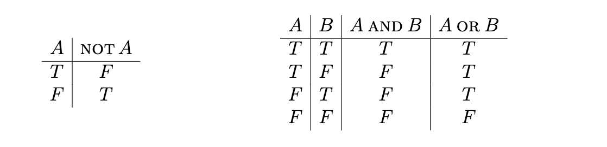
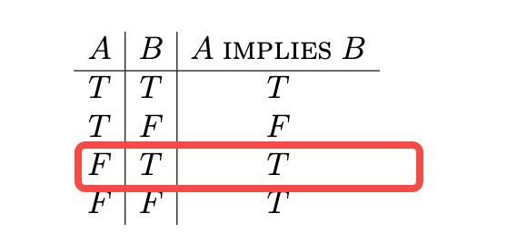

# 什么是证明（What is a proof?）

证明即确定真相的方法
比如：
- 实验
- 调研
- 问题（课堂上学生提出的）  
- 法律
- 权威（比如教授老师，这里老师在课堂上说老师有时候同样会犯错，可以质疑的 ）
- 信念
- 宗教

定义 1. 数学证明是通过从一组公理出发的一系列逻辑推演来验证一个命题的过程。

# 命题（Propositions）
定义 2. 命题是一个要么为真要么为假的陈述。
定义 3. 谓词是一个其真值取决于变量的命题。

这里课堂上老师举了三个例子

这里第一个第二个都是命题
第一个是真命题
第二个是假命题

至于第三个，这里出现了∀（任意）n ∈（属于） N（自然数）
这是不是一个命题？∀n ∈ N. n2 + n + 41 is prime
只看右边的话，简化成 P is prime ？ 这里P是未知的 因此未知的数不可以确定为质数，是带有变量的，得确定了变量才可以是一个命题，因此不是命题，但左边加上了限定范围条件 对任意自然数，就变成了命题

对于左边这样的描述 称之为谓词
定义4：谓词是一个真值取决于变量的命题
发现枚举到n=41发现不属于质数，即命题为假
注意需证明某个命题为假只需要找到一个反例就行

(Goldbach’s Conjecture). Every even number greater than 2 is the sum of
two primes.
（哥德巴赫猜想）。所有大于 2 的偶数都可以表示为两个质数之和。
之所以称之为猜想，因为不知道它到底是否为真

老师指出可以提出很简单的猜想、问题、定理，但超过了人类可以理解的范围

当年有人提出20可以等9+11 但9不是质数因此猜想为假？
实际上20可以等于13+7或者17+3，仍然符合猜想

# 命题组合

以上为非A的三种表达形式
A ∧ B（A和B，A和B同时为真才为真）
A ∨ B（A和B，任意一个为真则为真）
### 真值表（truth tables）

可以用真值表来表示，很直观

这里老师在课堂提了下或和生活的或不一样
比如：
- 在婚礼上，服务员说晚餐选择是“鸡肉或意面”，而“或”这个词的意思是传达一组允许的回应。在这种情况下，你可以选择“鸡肉”或“意面”，但不能选择“两者都要”或“都不选”，因为他们已经看到了所有的回复卡。这不是我们定义的“或”，它是异或，表示为xor
- 服务员接着说你可以选择“咖啡或茶”，这次你可以选择“咖啡”、“茶”或“都不选”，但不能选择“两者都要”，而且他们不会在一个正式的派对上把两种饮料混合！这同样不是“或”，而是“与非”，有时称为 nand
- 对于你的咖啡，服务员提供了“奶油或糖”。这次，所有 4 个选项都是有效的！英语单词“或”的使用了三次，但它们实际上都没有表示“或”的意思。

# 蕴含（Implication）
A 蕴含 B，也记作 A → B 或 A ⇒ B
读作“A蕴含B”，即“如果 A 则 B”。

这里绘制了下真值表，但是第三个得注意：当A为F，B为T，A蕴含B为啥为T，这里举例子，假设今天是星期三，则老师只穿粉红色衣服，假设今天不是星期三，老师只穿粉红色衣服 遵守了A->B的规则，因此为真

注意，在日常语言表达中，说A蕴含B常会说A cause B，即A发生导致了B，这不对 不存在因果关系 不可以拥有时间的概念附加在其中，因为A和B都是独立的命题 现在或者将来的真值表完美不一定知道，但它仍然是命题，总会有真值表，一旦确立了真值表关系 A蕴含B这个组合大命题可以确立真值表关系了

Descartes: “I think therefore I am.”
笛卡尔：我思故我在
我思设置为命题T，我在为A，即T蕴含A
不思考就不存在？ 非T->非A？ 鞋子不思考但是她存在 因此这个命题为假
这个是原命题的否命题
