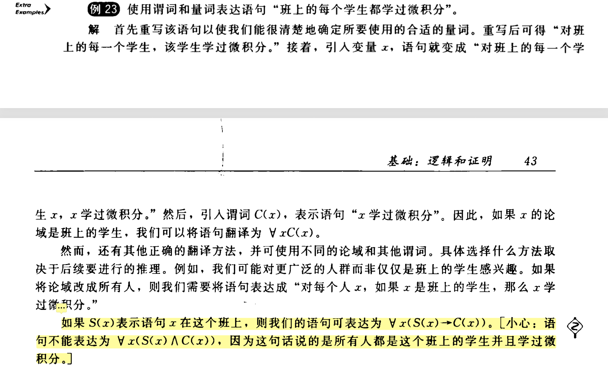
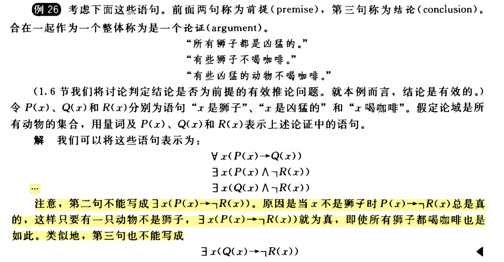

# 1，命理逻辑

| **<font style="color:rgb(26, 26, 26);">概念</font>** | **<font style="color:rgb(26, 26, 26);">备注</font>** |
| :--- | :--- |
| **<font style="color:rgb(91, 96, 102);">命题</font>** | <font style="color:rgb(91, 96, 102);">判断一个语句是否为命题（或真或假，不可既真又假）</font> |
| **<font style="color:rgb(91, 96, 102);">否定 ¬p</font>** | <font style="color:rgb(91, 96, 102);">真值表：p=T 则 ¬p=F，反之亦然</font> |
| **<font style="color:rgb(91, 96, 102);">合取 p∧q</font>** | <font style="color:rgb(91, 96, 102);">"p 并且 q"，仅当两者皆真时才为真</font> |
| **<font style="color:rgb(91, 96, 102);">析取 p∨q</font>** | <font style="color:rgb(91, 96, 102);">"p 或 q"（兼或），仅当两者皆假时才为假</font> |
| **<font style="color:rgb(91, 96, 102);">异或 p⊕q</font>** | <font style="color:rgb(91, 96, 102);">恰好一个为真时才为真，两者同真时为假</font> |
| **<font style="color:rgb(91, 96, 102);">条件语句 p→q</font>** | <font style="color:rgb(91, 96, 102);">"如果 p 则 q"，仅当 p 真 q 假时为假（其余情况为真）</font> |
| **<font style="color:rgb(91, 96, 102);">双条件 p</font>****<font style="color:rgb(91, 96, 102);">↔</font>****<font style="color:rgb(91, 96, 102);">q</font>** | <font style="color:rgb(91, 96, 102);">"p 当且仅当 q"，两者真值相同时为真</font> |
| **<font style="color:rgb(91, 96, 102);">真值表</font>** | <font style="color:rgb(91, 96, 102);">能列出任意复合命题的真值表</font> |
| **<font style="color:rgb(91, 96, 102);">运算符优先级</font>** | <font style="color:rgb(91, 96, 102);">¬ > ∧ > ∨ > → > </font><font style="color:rgb(91, 96, 102);">↔</font> |
| **<font style="color:rgb(91, 96, 102);">比特运算</font>** | <font style="color:rgb(91, 96, 102);">比特串的按位 AND/OR/XOR（如 01 1011 ∨ 11 0001 = 11 1011）</font> |

# 命题逻辑的应用

| **<font style="color:rgb(26, 26, 26);">应用领域</font>** | **<font style="color:rgb(26, 26, 26);">备注</font>** |
| :--- | :--- |
| **<font style="color:rgb(91, 96, 102);">语句翻译</font>** | <font style="color:rgb(91, 96, 102);">"仅当" = →；"除非" = ¬q→p 或 p∨q；消除自然语言歧义</font> |
| **<font style="color:rgb(91, 96, 102);">系统规范说明</font>** | <font style="color:rgb(91, 96, 102);">将需求翻译为逻辑表达式，判断规范是否一致（是否存在同时满足所有条件的真值赋值）</font> |
| **<font style="color:rgb(91, 96, 102);">布尔搜索</font>** | <font style="color:rgb(91, 96, 102);">AND/OR/NOT 在搜索引擎中的使用（如 Google 中用</font><font style="color:rgb(91, 96, 102);"> </font>`<font style="color:rgb(91, 96, 102);">-</font>`<br/><font style="color:rgb(91, 96, 102);"> </font><font style="color:rgb(91, 96, 102);">代替 NOT）</font> |
| **<font style="color:rgb(91, 96, 102);">逻辑谜题</font>** | <font style="color:rgb(91, 96, 102);">骑士与无赖（骑士只说真话，无赖只说假话）；泥巴孩子谜题</font> |
| **<font style="color:rgb(91, 96, 102);">逻辑电路</font>** | <font style="color:rgb(91, 96, 102);">非门/与门/或门的符号，给定电路能写出对应逻辑表达式，反之亦然</font> |


# 3，命题等价式

| **<font style="color:rgb(26, 26, 26);">概念</font>** | **<font style="color:rgb(26, 26, 26);">你需掌握什么</font>** |
| :--- | :--- |
| **<font style="color:rgb(91, 96, 102);">永真式（T）</font>** | <font style="color:rgb(91, 96, 102);">无论变量取值如何，恒为真的复合命题</font> |
| **<font style="color:rgb(91, 96, 102);">矛盾式（F）</font>** | <font style="color:rgb(91, 96, 102);">恒为假的复合命题</font> |
| **<font style="color:rgb(91, 96, 102);">可能式</font>** | <font style="color:rgb(91, 96, 102);">有时为真有时为假的命题</font> |
| **<font style="color:rgb(91, 96, 102);">逻辑等价 p≡q</font>** | <font style="color:rgb(91, 96, 102);">p</font><font style="color:rgb(91, 96, 102);">↔</font><font style="color:rgb(91, 96, 102);">q 是永真式，两个命题真值表完全相同</font> |
| **<font style="color:rgb(91, 96, 102);">德·摩根律</font>** | <font style="color:rgb(91, 96, 102);">¬(p∧q) ≡ ¬p∨¬q；¬(p∨q) ≡ ¬p∧¬q</font> |
| **<font style="color:rgb(91, 96, 102);">等价式表（表6）</font>** | <font style="color:rgb(91, 96, 102);">恒等律、支配律、幂等律、双重否定律、交换律、结合律、分配律、吸收律、条件语句等价式</font><font style="color:rgb(91, 96, 102);"> </font>`<font style="color:rgb(91, 96, 102);">p→q ≡ ¬p∨q</font>` |
| **<font style="color:rgb(91, 96, 102);">可满足性</font>** | <font style="color:rgb(91, 96, 102);">存在一组真值赋值使命题为真</font> |
| **<font style="color:rgb(91, 96, 102);">SAT 问题</font>** | <font style="color:rgb(91, 96, 102);">数独、n皇后等问题可归约为 SAT 求解</font> |

# 谓词和量词

| **<font style="color:rgb(26, 26, 26);">概念</font>** | **<font style="color:rgb(26, 26, 26);">你需掌握什么</font>** |
| :--- | :--- |
| **<font style="color:rgb(91, 96, 102);">谓词 P(x)</font>** | <font style="color:rgb(91, 96, 102);">含变量的陈述，变量赋值后变为命题（如 "x>3"）</font> |
| **<font style="color:rgb(91, 96, 102);">全称量词 ∀xP(x)</font>** | <font style="color:rgb(91, 96, 102);">"对所有 x，P(x)为真"，论域中每个元素都满足</font> |
| **<font style="color:rgb(91, 96, 102);">存在量词 ∃xP(x)</font>** | <font style="color:rgb(91, 96, 102);">"存在某个 x 使 P(x)为真"，论域中至少一个元素满足</font> |
| **<font style="color:rgb(91, 96, 102);">唯一存在量词 ∃!xP(x)</font>** | <font style="color:rgb(91, 96, 102);">恰好存在一个 x 满足</font> |
| **<font style="color:rgb(91, 96, 102);">量词否定</font>** | <font style="color:rgb(91, 96, 102);">¬∀xP(x) ≡ ∃x¬P(x)；¬∃xP(x) ≡ ∀x¬P(x)</font> |
| **<font style="color:rgb(91, 96, 102);">受限域量词</font>** | <font style="color:rgb(91, 96, 102);">∀x<0 (x²>0) 等</font> |
| **<font style="color:rgb(91, 96, 102);">变量绑定</font>** | <font style="color:rgb(91, 96, 102);">被量词约束的变量 vs 自由变量</font> |
| **<font style="color:rgb(91, 96, 102);">翻译</font>** | <font style="color:rgb(91, 96, 102);">自然语言 </font><font style="color:rgb(91, 96, 102);">↔</font><font style="color:rgb(91, 96, 102);"> 谓词逻辑表达式</font> |
| **<font style="color:rgb(91, 96, 102);">逻辑程序设计</font>** | <font style="color:rgb(91, 96, 102);">Prolog 的基本思想：事实 + 规则 → 查询</font> |


### 习题
- 习题一

这里注意下：假设论域是所有人（或所有学生）：

∀x(S(x) → C(x)) ✓
"对任意一个人 x，如果 x 在这个班上，那么 x 学过微积分"

对班上的学生：S(x)=T，要求 C(x)=T → 学过微积分 ✅
对不在班上的人：S(x)=F → 条件语句 S(x)→C(x) 自动为真（前件假则条件语句为真）→ 不做任何要求 ✅
正确！只约束了班上的人。

∀x(S(x) ∧ C(x)) ✗
"对任意一个人 x，x 在这个班上 并且 x 学过微积分"

这意味着论域中的每一个人都必须同时满足：

在这个班上
学过微积分
对不在班上的人：S(x)=F，合取直接为假 → 整个命题为假 ❌
错误！这句话等于说"世界上所有人都是这个班的学生，而且都学过微积分"。

- 习题二

  
这里注意下：第二句："有些狮子不喝咖啡"
正确写法：∃x(P(x) ∧ ¬R(x))
"存在一个 x，x 是狮子 并且 x 不喝咖啡"

这个 x 必须同时满足两个条件，√ 符合原意。

错误写法：∃x(P(x) → ¬R(x))
"存在一个 x，如果 x 是狮子，那么 x 不喝咖啡"

分析这个命题什么时候为真：

x	是不是狮子	P(x)→¬R(x)
一只猫	不是 (P=F)	F→? = T ✅
只要存在一只不是狮子的动物（比如一只猫），P(x)→¬R(x) 就为真！因为条件语句的前件为假时，整个语句自动为真。

这意味着：即使世界上所有狮子都喝咖啡，只要存在一只猫，∃x(P(x)→¬R(x)) 依然为真。

这完全歪曲了原意。原意是"存在某只狮子不喝咖啡"，而不是"存在某只动物，如果它是狮子的话就不喝咖啡"。

第三句："有些凶猛的动物不喝咖啡"
完全同理：

写法	含义
∃x(Q(x) ∧ ¬R(x)) ✓	存在一只凶猛且不喝咖啡的动物
∃x(Q(x) → ¬R(x)) ✗	只要存在一只不凶猛的动物（比如兔子），命题就为真
最终口诀

Plain Text

∀ → 条件     (全称量词搭配"如果...则...")
∃ → 合取     (存在量词搭配"并且")
一句话记住：∀ 和 → 是一对，∃ 和 ∧ 是一对。反过来搭配就会出问题。

# 嵌套量词

| **<font style="color:rgb(26, 26, 26);">概念</font>** | **<font style="color:rgb(26, 26, 26);">你需掌握什么</font>** |
| :--- | :--- |
| **<font style="color:rgb(91, 96, 102);">量词顺序</font>** | <font style="color:rgb(91, 96, 102);">∀x∀y P(x,y) ≡ ∀y∀x P(x,y)，但 ∀x∃y 和 ∃y∀x 不等价！</font> |
| **<font style="color:rgb(91, 96, 102);">数学翻译</font>** | <font style="color:rgb(91, 96, 102);">极限定义、函数定义等用嵌套量词表达</font> |
| **<font style="color:rgb(91, 96, 102);">嵌套量词否定</font>** | <font style="color:rgb(91, 96, 102);">从外向内逐层否定：¬∀x∃y∀z P ≡ ∃x∀y∃z ¬P</font> |
| **<font style="color:rgb(91, 96, 102);">自然语言翻译</font>** | <font style="color:rgb(91, 96, 102);">双向翻译：汉语 </font><font style="color:rgb(91, 96, 102);">↔</font><font style="color:rgb(91, 96, 102);"> 嵌套量词逻辑式</font> |


# 推理规则
### <font style="color:rgb(26, 26, 26);">核心知识点</font>
| **<font style="color:rgb(26, 26, 26);">推理规则</font>** | **<font style="color:rgb(26, 26, 26);">形式</font>** |
| :--- | :--- |
| **<font style="color:rgb(91, 96, 102);">假言推理 (Modus Ponens)</font>** | `<font style="color:rgb(91, 96, 102);">p→q, p ∴ q</font>` |
| **<font style="color:rgb(91, 96, 102);">取拒式 (Modus Tollens)</font>** | `<font style="color:rgb(91, 96, 102);">p→q, ¬q ∴ ¬p</font>` |
| **<font style="color:rgb(91, 96, 102);">假言三段论</font>** | `<font style="color:rgb(91, 96, 102);">p→q, q→r ∴ p→r</font>` |
| **<font style="color:rgb(91, 96, 102);">析取三段论</font>** | `<font style="color:rgb(91, 96, 102);">p∨q, ¬p ∴ q</font>` |
| **<font style="color:rgb(91, 96, 102);">附加律</font>** | `<font style="color:rgb(91, 96, 102);">p ∴ p∨q</font>` |
| **<font style="color:rgb(91, 96, 102);">化简律</font>** | `<font style="color:rgb(91, 96, 102);">p∧q ∴ p</font>` |
| **<font style="color:rgb(91, 96, 102);">合取律</font>** | `<font style="color:rgb(91, 96, 102);">p, q ∴ p∧q</font>` |
| **<font style="color:rgb(91, 96, 102);">消解律</font>** | `<font style="color:rgb(91, 96, 102);">p∨q, ¬p∨r ∴ q∨r</font>` |
| **<font style="color:rgb(91, 96, 102);">全称实例</font>** | `<font style="color:rgb(91, 96, 102);">∀xP(x) ∴ P(c)</font>` |
| **<font style="color:rgb(91, 96, 102);">全称引入</font>** | <font style="color:rgb(91, 96, 102);">对任意c有P(c) ∴</font><font style="color:rgb(91, 96, 102);"> </font>`<font style="color:rgb(91, 96, 102);">∀xP(x)</font>` |
| **<font style="color:rgb(91, 96, 102);">存在实例</font>** | `<font style="color:rgb(91, 96, 102);">∃xP(x) ∴ P(c)</font>`<br/><font style="color:rgb(91, 96, 102);"> </font><font style="color:rgb(91, 96, 102);">对某个c</font> |
| **<font style="color:rgb(91, 96, 102);">存在引入</font>** | `<font style="color:rgb(91, 96, 102);">P(c) ∴ ∃xP(x)</font>` |
| **<font style="color:rgb(91, 96, 102);">全称假言推理</font>** | `<font style="color:rgb(91, 96, 102);">∀x(P(x)→Q(x)), P(a) ∴ Q(a)</font>` |


### <font style="color:rgb(26, 26, 26);">常见谬误：</font>
+ **<font style="color:rgb(26, 26, 26);">肯定结论谬误</font>**<font style="color:rgb(26, 26, 26);">：</font>`<font style="color:rgb(23, 24, 26);">p→q, q ∴ p</font>`<font style="color:rgb(26, 26, 26);">（无效！）</font>
+ **<font style="color:rgb(26, 26, 26);">否定假设谬误</font>**<font style="color:rgb(26, 26, 26);">：</font>`<font style="color:rgb(23, 24, 26);">p→q, ¬p ∴ ¬q</font>`<font style="color:rgb(26, 26, 26);">（无效！）</font>

  


# 7，证明
### <font style="color:rgb(26, 26, 26);">7.1 什么是证明</font>
**<font style="color:rgb(26, 26, 26);">证明（proof）</font>**<font style="color:rgb(26, 26, 26);"> </font><font style="color:rgb(26, 26, 26);">= 建立数学语句真实性的有效论证。使用：</font>

+ <font style="color:rgb(26, 26, 26);">定理的假设（前提）</font>
+ <font style="color:rgb(26, 26, 26);">公理（假定为真的基本事实）</font>
+ <font style="color:rgb(26, 26, 26);">已证定理</font>
+ <font style="color:rgb(26, 26, 26);">推理规则（1.6节）</font>

---

### <font style="color:rgb(26, 26, 26);">7.2 重要定义</font>
**<font style="color:rgb(26, 26, 26);">定义1 — 偶数与奇数</font>**

<font style="color:rgb(91, 96, 102);">整数 n 是</font>**<font style="color:rgb(91, 96, 102);">偶数</font>**<font style="color:rgb(91, 96, 102);">：存在整数 k 使得 n = 2k 整数 n 是</font>**<font style="color:rgb(91, 96, 102);">奇数</font>**<font style="color:rgb(91, 96, 102);">：存在整数 k 使得 n = 2k + 1</font>

**<font style="color:rgb(26, 26, 26);">定义2 — 有理数与无理数</font>**

<font style="color:rgb(91, 96, 102);">实数 r 是</font>**<font style="color:rgb(91, 96, 102);">有理数</font>**<font style="color:rgb(91, 96, 102);">：存在整数 p 和 q（q ≠ 0）使得 r = p/q</font><font style="color:rgb(91, 96, 102);"> </font>**<font style="color:rgb(91, 96, 102);">无理数</font>**<font style="color:rgb(91, 96, 102);">：不是有理数的实数</font>

---

### <font style="color:rgb(26, 26, 26);">7.3 证明方法总览</font>
<font style="color:rgb(26, 26, 26);">本节介绍的证明方法都针对形如</font><font style="color:rgb(26, 26, 26);"> </font>**<font style="color:rgb(26, 26, 26);">∀x(P(x) → Q(x))</font>**<font style="color:rgb(26, 26, 26);"> </font><font style="color:rgb(26, 26, 26);">的定理（即"如果...则..."类型的条件语句）。</font>

---

### <font style="color:rgb(26, 26, 26);">7.4 直接证明法（Direct Proof）</font>
**<font style="color:rgb(26, 26, 26);">思路</font>**<font style="color:rgb(26, 26, 26);">：假设 p 为真 → 用推理规则推导 → 证明 q 也必须为真。</font>

<font style="color:rgb(91, 96, 102);">Plain Text</font>

```plain
假设 P(x) 为真
  ↓ (公理、定义、推理)
Q(x) 为真
```

**<font style="color:rgb(26, 26, 26);">例1</font>**<font style="color:rgb(26, 26, 26);">：如果 n 是奇数，则 n² 是奇数。</font>

<font style="color:rgb(91, 96, 102);">证明：n = 2k+1 → n² = 4k²+4k+1 = 2(2k²+2k)+1 → n² 是奇数。</font>

**<font style="color:rgb(26, 26, 26);">例2</font>**<font style="color:rgb(26, 26, 26);">：如果 m 和 n 都是完全平方数，则 mn 也是完全平方数。</font>

<font style="color:rgb(91, 96, 102);">证明：m = s², n = t² → mn = s²t² = (st)²。</font>

---

### <font style="color:rgb(26, 26, 26);">7.5 反证法（Proof by Contraposition）</font>
**<font style="color:rgb(26, 26, 26);">思路</font>**<font style="color:rgb(26, 26, 26);">：p → q 等价于 ¬q → ¬p。所以不直接证 p→q，而是证它的逆否命题。</font>

<font style="color:rgb(91, 96, 102);">Plain Text</font>

```plain
假设 ¬Q(x) 为真
  ↓ (公理、定义、推理)
¬P(x) 为真
→ 原命题 P(x) → Q(x) 得证
```

**<font style="color:rgb(26, 26, 26);">例3</font>**<font style="color:rgb(26, 26, 26);">：如果 3n+2 是奇数，则 n 是奇数。</font>

<font style="color:rgb(91, 96, 102);">反证：假设 n 是偶数 → n=2k → 3n+2 = 6k+2 = 2(3k+1) → 偶数 → 不是奇数。证毕。</font>

**<font style="color:rgb(26, 26, 26);">例4</font>**<font style="color:rgb(26, 26, 26);">：如果 n=ab（a,b正整数），则 a≤√n 或 b≤√n。</font>

<font style="color:rgb(91, 96, 102);">反证：假设 a>√n 且 b>√n → ab > n，矛盾。</font>

---

### <font style="color:rgb(26, 26, 26);">7.6 空证明和平凡证明（Vacuous & Trivial Proof）</font>
| **<font style="color:rgb(26, 26, 26);">类型</font>** | **<font style="color:rgb(26, 26, 26);">条件</font>** | **<font style="color:rgb(26, 26, 26);">为什么有效</font>** |
| :--- | :--- | :--- |
| **<font style="color:rgb(91, 96, 102);">空证明</font>** | <font style="color:rgb(91, 96, 102);">前提 p 恒为假</font> | <font style="color:rgb(91, 96, 102);">p→q 当前件为假时自动为真</font> |
| **<font style="color:rgb(91, 96, 102);">平凡证明</font>** | <font style="color:rgb(91, 96, 102);">结论 q 恒为真</font> | <font style="color:rgb(91, 96, 102);">p→q 当结论为真时自动为真</font> |


**<font style="color:rgb(26, 26, 26);">例5（空证明）</font>**<font style="color:rgb(26, 26, 26);">：P(0)："如果 0>1，则 0²>0"。前提 0>1 为假，命题自动为真。</font>

**<font style="color:rgb(26, 26, 26);">例6（平凡证明）</font>**<font style="color:rgb(26, 26, 26);">：P(0)："如果 a≥b，则 a⁰≥b⁰"。a⁰=b⁰=1，结论恒真，命题自动为真。</font>

---

### <font style="color:rgb(26, 26, 26);">7.7 归谬证明法（Proof by Contradiction）</font>
**<font style="color:rgb(26, 26, 26);">思路</font>**<font style="color:rgb(26, 26, 26);">：要证 p 为真，假设 ¬p 为真，推导出矛盾（如 r ∧ ¬r），从而 ¬p 必为假，p 为真。</font>

<font style="color:rgb(91, 96, 102);">Plain Text</font>

```plain
假设 ¬p 为真
  ↓
推导出矛盾（如 q ∧ ¬q）
  ↓
¬p 为假 → p 为真
```

**<font style="color:rgb(26, 26, 26);">例10（鸽巢原理）</font>**<font style="color:rgb(26, 26, 26);">：任意22天中至少有4天属于同一星期。</font>

<font style="color:rgb(91, 96, 102);">反证：假设至多3天/星期 → 7×3=21天 → 但我们有22天，矛盾。</font>

**<font style="color:rgb(26, 26, 26);">例11（经典）</font>**<font style="color:rgb(26, 26, 26);">：√2 是无理数。</font>

<font style="color:rgb(91, 96, 102);">反证：假设 √2 = a/b（既约分数）→ 2b² = a² → a 是偶数 → b 也是偶数 → a,b 有公因子2，与"既约"矛盾。</font>

**<font style="color:rgb(26, 26, 26);">例12</font>**<font style="color:rgb(26, 26, 26);">：将条件语句的反证改写为归谬证明。</font>

<font style="color:rgb(91, 96, 102);">要证 p→q，同时假设 p 和 ¬q，推导出 p ∧ ¬p 的矛盾。</font>

---

### <font style="color:rgb(26, 26, 26);">7.8 等价证明法（Proof of Equivalence）</font>
**<font style="color:rgb(26, 26, 26);">思路</font>**<font style="color:rgb(26, 26, 26);">：要证 p </font><font style="color:rgb(26, 26, 26);">↔</font><font style="color:rgb(26, 26, 26);"> q，需分别证明 p → q 和 q → p。</font>

**<font style="color:rgb(26, 26, 26);">例13</font>**<font style="color:rgb(26, 26, 26);">：n 是奇数 </font><font style="color:rgb(26, 26, 26);">↔</font><font style="color:rgb(26, 26, 26);"> n² 是奇数（已在例1和例9中分别证明两个方向）。</font>

---

### <font style="color:rgb(26, 26, 26);">7.9 反例（Counterexample）</font>
**<font style="color:rgb(26, 26, 26);">思路</font>**<font style="color:rgb(26, 26, 26);">：要证 ∀xP(x) 为假，只需找出一个反例 a 使得 P(a) 为假。</font>

<font style="color:rgb(91, 96, 102);">反例不是证明"所有"成立的方法，而是证伪全称命题的方法。</font>
